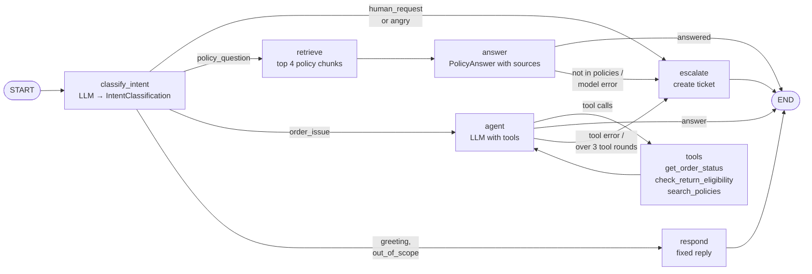
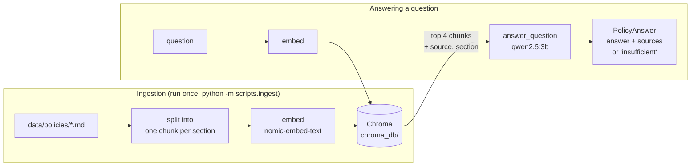

# Agentic Customer Support Assistant

[](https://github.com/hmadhe/agentic-customer-support/actions/workflows/tests.yml)

An AI customer-support assistant for **VoltCart**, a fictional online electronics store. When finished, it will answer policy questions from company documents (RAG), look up orders using tools, and hand the conversation to a human when it should. It is built with **LangChain, LangGraph, Pydantic and FastAPI** and runs on a **local LLM through Ollama**, so no paid API key is needed.

The project is built in small milestones. Each one is planned, implemented, run, tested, debugged and reviewed before the next one starts. The [development log](#development-log) records what was built and what went wrong along the way.

> **Status:** Milestone 8 of 10 complete. The unit tests run automatically on GitHub Actions for every push. A LangGraph workflow classifies each customer message. **Policy questions go to RAG**, and **order questions go to a tool-calling agent** that looks up orders in SQLite. When the customer asks for a person, is angry, or the assistant can't answer reliably, it **escalates** with a support ticket. Conversations are **remembered**, and since Milestone 7 everything is served by a **FastAPI** HTTP API whose conversations survive a server restart. See the [roadmap](#roadmap).

---

## Table of contents

- [What the assistant will do](#what-the-assistant-will-do)
- [Tech stack](#tech-stack)
- [Architecture](#architecture)
- [Project structure](#project-structure)
- [Getting started](#getting-started)
- [Configuration](#configuration)
- [How the current code works](#how-the-current-code-works)
- [Testing](#testing)
- [Troubleshooting](#troubleshooting)
- [Development log](#development-log)
- [Roadmap](#roadmap)
- [Out of scope](#out-of-scope)

---

## What the assistant will do

A VoltCart customer sends a message, and the assistant decides what kind of help it needs:

| Customer message | What the assistant does |
|---|---|
| *"What is your return policy?"* | Searches VoltCart's policy documents and answers with the source it used (RAG) |
| *"Where is my order #1042?"* | Calls a tool that looks the order up in a database |
| *"This is the third time I'm asking. I want a person!"* | Creates a support ticket with a summary and hands off to a human |
| *"And what about my other order?"* | Uses the earlier conversation to understand the follow-up |

It also escalates to a human when it **cannot find a reliable answer**, rather than guessing.

---

## Tech stack

| Technology | Role in this project | Status |
|---|---|---|
| **Python 3.11** | Language | ✅ In use |
| **Ollama + `qwen2.5:3b`** | Runs the chat LLM locally on the CPU, free and offline | ✅ In use |
| **Ollama + `nomic-embed-text`** | Local embedding model: turns text into vectors for search | ✅ In use |
| **LangChain** | Building blocks: chat model interface, structured output, tools, document loaders, retrievers | ✅ In use (chat model, prompts, structured output, text splitters, embeddings, Chroma wrapper) |
| **Pydantic** | Validated data models for settings, LLM outputs, tool inputs and API requests/responses | ✅ In use (settings, LLM output schemas, graph state, retrieved chunks) |
| **LangGraph** | Orchestrates the workflow: classify, route, act, answer or escalate | ✅ In use (conditional routing, agent ⇄ tools loop with `ToolNode`) |
| **Chroma** | Local vector store for document search (RAG), saved to disk | ✅ In use |
| **pytest** | Automated tests | ✅ In use |
| **SQLite** | Mock order database and support tickets | ✅ In use |
| **FastAPI + uvicorn** | HTTP API that exposes the assistant; Swagger UI at `/docs` as the demo | ✅ In use |

---

## Architecture

The target design is below. **Most of it is not built yet.** Each milestone adds one piece.

```
   Client (curl / Swagger UI / CLI)
                 │
                 ▼
   ┌──────────────────────────────┐
   │ FastAPI                      │  POST /chat, GET /tickets
   │ (Pydantic request/response)  │
   └──────────────┬───────────────┘
                  ▼
   ┌──────────────────────────────┐
   │ LangGraph support workflow   │◄── Checkpointer (conversation memory)
   └──┬──────────┬──────────┬─────┘
      │          │          │
      ▼          ▼          ▼
   LLM via    Retriever   Tools ─────────► Order database (SQLite)
   LangChain     │          │
   (Ollama)      ▼          └─ create_ticket ► Tickets (SQLite)
          Vector store (Chroma)
                 ▲
          Ingest script ◄── VoltCart policy documents (markdown)
```

### Planned LangGraph workflow


The graph grows in stages. **The current graph (Milestone 5):**



### The RAG pipeline

Built in Milestone 2 and connected to the graph in Milestone 3 as the `retrieve` and `answer` nodes.



---

## Project structure

```
agentic-customer-support/
├── app/                  # Application code (the importable Python package)
│   ├── __init__.py       # Marks app/ as a package so `from app... import` works
│   ├── config.py         # Settings: reads .env and validates it with Pydantic
│   ├── llm.py            # get_llm(): the single place where the LLM is created
│   ├── schemas.py        # Pydantic models: IntentClassification, RetrievedChunk, PolicyAnswer
│   ├── classifier.py     # Prompt + LLM that turns a message into an IntentClassification
│   ├── graph.py          # LangGraph workflow: state, nodes, routing and build_graph()
│   ├── vector_store.py   # Embedding model + Chroma collection, shared by ingestion and retrieval
│   ├── ingest.py         # Load policy docs → split into chunks → embed → store
│   ├── retriever.py      # Question → most relevant chunks with source and section
│   ├── answer.py         # Question + chunks → answer with sources, "insufficient information", or AnswerGenerationError
│   ├── orders.py         # SQLite order database + return-eligibility rules (pure Python)
│   ├── tools.py          # LangChain tools the agent can call, with Pydantic-validated inputs
│   ├── agent.py          # Agent prompt, tool-round limit, and the invented-order-ID guard
│   ├── tickets.py        # Support tickets (SQLite), escalation reasons and the replies for each
│   ├── memory.py         # Checkpointer (in memory or SQLite), conversation history, history trimming
│   └── api.py            # FastAPI app: /chat, /tickets, /health
├── data/
│   └── policies/         # VoltCart policy documents: shipping, returns, warranty, payments, account
├── scripts/
│   ├── hello_llm.py      # Smoke test: makes one real call to the LLM
│   ├── chat.py           # Command-line chat: type a message, see intent and reply
│   ├── ingest.py         # Builds the vector store from data/policies/
│   ├── seed_orders.py    # Creates the mock order database data/voltcart.db
│   ├── pass_rates.py     # Runs the real-model tests N times and reports each test's pass rate
│   ├── tickets.py        # Lists the support tickets created by escalations
│   └── ask.py            # Ask a policy question; shows retrieved chunks and the answer
├── tests/
│   ├── conftest.py              # Shared fixtures: blocks real model calls in unit tests; test vector store and order DB
│   ├── test_llm.py              # Unit test: the LLM is configured from settings
│   ├── test_graph.py            # Unit tests: every route, the agent loop and its safeguards (scripted fake agent)
│   ├── test_orders.py           # Unit tests: order database and return-eligibility rules
│   ├── test_tools.py            # Unit tests: tool inputs and outputs, invented-order-ID detection
│   ├── test_tickets.py          # Unit tests: creating and listing tickets, schema migration
│   ├── test_memory.py           # Unit tests: multi-turn conversations, per-turn reset, trimming, restart
│   ├── test_api.py              # Unit tests: every endpoint, errors, concurrency, startup failure (fake graph)
│   ├── test_api_llm.py          # Real-model test: a policy question through the API (-m llm)
│   ├── test_pass_rates.py       # Unit test: reading pytest's JUnit XML results
│   ├── test_ingest.py           # Unit tests: chunking, metadata, no duplicates on re-ingest (fake embeddings)
│   ├── test_retriever.py        # Unit test: retrieved chunks carry source and section (fake embeddings)
│   ├── test_answer.py           # Unit tests: source filtering and "insufficient" handling (fake answer chain)
│   ├── test_classifier_llm.py   # Real-model tests: classification accuracy (run with -m llm)
│   ├── test_rag_llm.py          # Real-model tests: retrieval and answers on the real documents (-m llm)
│   └── test_graph_llm.py        # Real-model tests: whole graph end to end (-m llm)
├── .github/workflows/
│   └── tests.yml         # GitHub Actions: runs the unit tests on every push and pull request
├── .env.example          # Template for your local .env (committed to git)
├── .gitignore            # Keeps .env, .venv/ and caches out of git
├── pytest.ini            # pytest configuration
├── requirements.txt      # Pinned Python dependencies
└── README.md             # This file
```

These files are created locally and **never committed**:

| Path | What it is |
|---|---|
| `.venv/` | The project's private Python environment with all dependencies installed |
| `.env` | Your local settings, copied from `.env.example`. Hosted LLM API keys would go here too, so it is never committed |
| `chroma_db/` | The vector store built by `python -m scripts.ingest`. It is rebuilt from `data/policies/`, so it doesn't need to be in git |
| `data/voltcart.db` | The mock order database created by `python -m scripts.seed_orders`. Its dates are relative to the day it was seeded |
| `data/tickets.db` | Support tickets created by escalations. Created automatically on the first escalation and kept when the orders are re-seeded |
| `data/conversations.db` | The API's saved conversations (LangGraph checkpoints), so they survive a server restart. Delete it to forget all conversations |

---

## Getting started

### Prerequisites

| Requirement | Notes |
|---|---|
| **Python 3.11** | 3.12 also works. Very new releases (3.14) may not be supported by every LangChain dependency yet |
| **Ollama** | Download from <https://ollama.com/download> |
| **About 2.5 GB of disk** | For the `qwen2.5:3b` model (1.9 GB) and the `nomic-embed-text` embedding model (about 270 MB) |
| **8 GB RAM** | Enough for a 3B-parameter model on the CPU. A GPU is not required |

### 1. Clone the repository

```bash
git clone https://github.com/hmadhe/agentic-customer-support.git
cd agentic-customer-support
```

### 2. Create and activate a virtual environment

A virtual environment keeps this project's packages separate from every other Python project on your machine.

```powershell
# Windows (PowerShell)
py -3.11 -m venv .venv
.\.venv\Scripts\Activate.ps1
```

```bash
# macOS / Linux
python3.11 -m venv .venv
source .venv/bin/activate
```

Your prompt should now start with `(.venv)`.

> **Windows tip:** if PowerShell says *"running scripts is disabled on this system"*, run `Set-ExecutionPolicy -Scope CurrentUser RemoteSigned` once, then activate again.

### 3. Install dependencies

```bash
pip install -r requirements.txt
```

### 4. Download the models

Make sure Ollama is running (open the Ollama app, or run `ollama serve`), then:

```bash
ollama pull qwen2.5:3b          # chat model
ollama pull nomic-embed-text    # embedding model for RAG
ollama list                     # both should appear
```

### 5. Create your `.env` file

```powershell
# Windows
Copy-Item .env.example .env
```

```bash
# macOS / Linux
cp .env.example .env
```

The defaults work as they are. See [Configuration](#configuration) to change them.

### 6. Run the smoke test

Run this **from the project root**, using `-m`:

```bash
python -m scripts.hello_llm
```

Expected output (the exact wording may vary):

```
Model: qwen2.5:3b @ http://localhost:11434
Response: Hello! Welcome to VoltCart. How can I assist you today?
Latency: 4.0s
Tokens: {'input_tokens': 52, 'output_tokens': 15, 'total_tokens': 67}
```

The **first run after starting Ollama is much slower** (about 30 seconds) because the model is loaded into memory. Later runs take a few seconds.

### 7. Run the tests

```bash
python -m pytest -v
```

Expected: `101 passed, 51 deselected`. The 51 deselected tests call real models and are skipped by default. See [Testing](#testing).

### 8. Build the policy vector store and the order database

```bash
python -m scripts.ingest
python -m scripts.seed_orders
```

- **`ingest`** only needs to run again when a document in `data/policies/` changes, or when the embedding setup changes.
- **`seed_orders`** creates 12 mock orders with dates relative to today (for example, "delivered 10 days ago"). Re-run it to reset the orders, or if return-window answers start to look out of date. The chat refuses to start without this database.

### 9. Chat with the assistant

```bash
python -m scripts.chat
```

```
VoltCart support (type 'quit' to exit)

You: How much is express shipping?
  [intent=policy_question sentiment=neutral order_id=None]
Bot: $14.99
  [sources=['shipping.md'] answered=True]

You: Can I return the laptop from order 1001?
  [intent=order_issue sentiment=negative order_id=1001]
Bot: You can return the laptop from order 1001 until October 10, 2026. A 15% restocking fee applies.
  [tool: check_return_eligibility({'order_id': '1001'})]

You: I'm so angry, I want a refund NOW for order 1002
  [intent=order_issue sentiment=angry order_id=1002]
Bot: I'm sorry about your experience. I've passed this to our support team (ticket #1) so a team member can help you personally.
  [escalated: angry_customer]
```

This is real output. The second message is neutral but was labelled `negative`. Sentiment is imperfect, and that's exactly why only `angry` escalates: a wrong `negative` costs nothing.

**The chat remembers the conversation** until you quit. Real replies from a test run:

```
You: Where is my order 1001?
  [intent=order_issue sentiment=neutral order_id=1001]
Bot: Your order 1001 has been delivered. The Lenovo ThinkPad X1 laptop was delivered on 2026-09-25. Tracking number: VC100100.
  [tool: get_order_status({'order_id': '1001'})]

You: Can I return it?
  [intent=order_issue sentiment=negative order_id=1001]
Bot: You can return your order 1001 within the 15-day return window until 2026-10-10. A 15% restocking fee applies.
  [tool: check_return_eligibility({'order_id': '1001'})]
```

"It" was resolved from the previous turn. Follow-ups that refer to a *policy* topic only with "it" (for example "And how long does it take?" after a shipping question) don't work yet; see the [Milestone 6 log](#milestone-6-conversation-memory-).

The first bracket line shows how the LLM classified the message. **Policy questions are answered from the documents**, with the sources shown underneath. **Order questions are handled by the agent**, with the tools it called shown underneath. **Escalations** show their reason. On this 8 GB machine an answer takes about 15–30 seconds; see the [Milestone 3 log](#milestone-3-routing-policy-questions-to-rag-) for why.

To see the tickets that escalations created:

```bash
python -m scripts.tickets
```

```
#1 2026-10-05 17:29:32 [angry_customer] intent=order_issue sentiment=angry order=1002
    "I'm so angry, I want a refund NOW for order 1002"
```

**Mock orders to try:**

| Order | Product | Situation |
|---|---|---|
| 1001 | Laptop, opened, delivered 10 days ago | Returnable (15-day window), 15% restocking fee |
| 1002 | Laptop, opened, delivered 20 days ago | Return window over |
| 1004 | Earbuds, opened | Not returnable (hygiene) |
| 1005, 1042 | TV, headphones | Shipped, with tracking numbers |
| 1006 | Drone, opened | Returnable (30-day window), 15% restocking fee |
| 1007 | Tablet | Still processing |
| 1008 / 1009 | Gift card / clearance camera | Not returnable |
| 2231 | Over-ear headphones, delivered yesterday | Returnable; good for "arrived broken" questions |

### 10. Ask the RAG pipeline directly (optional)

`scripts.ask` skips the classifier and shows each retrieved chunk, which is useful for debugging retrieval.

```bash
python -m scripts.ask "How much is express shipping?" "Do you offer price matching?"
```

Actual output:

```
Stored 31 chunks. Collection now holds 31 chunks.

Q: How much is express shipping?
   retrieved 0.714  shipping.md > Shipping options and costs
   retrieved 0.581  shipping.md > Where we ship
   retrieved 0.570  shipping.md > Shipping to Canada
   retrieved 0.566  shipping.md > Tracking your order
A: $14.99
   answered=True sources=['shipping.md']

Q: Do you offer price matching?
   retrieved 0.627  payments.md > Currency and taxes
   retrieved 0.616  payments.md > When you are charged
   retrieved 0.609  payments.md > Accepted payment methods
   retrieved 0.604  shipping.md > Tracking your order
A: I'm sorry, I don't have VoltCart policy information that answers this question. A member of our support team can help.
   answered=False sources=[]
```

The second question shows two things. The retriever **always returns 4 chunks, even when none of them is relevant**, and the answer step is what recognises that they don't answer the question.

### 11. Run the API

```bash
uvicorn app.api:app --port 8200
```

Then open **<http://127.0.0.1:8200/docs>** for the interactive Swagger UI, or call it directly:

```bash
curl -X POST http://127.0.0.1:8200/chat -H "Content-Type: application/json" \
     -d '{"message": "Where is my order 1001?"}'
```

A real response:

```json
{"thread_id":"a9e8d41d-4d90-4baa-accc-5866f94d44f4",
 "reply":"Your order 1001 has been delivered. The Lenovo ThinkPad X1 laptop was delivered on 2026-09-25. Tracking number: VC100100.",
 "intent":"order_issue","sentiment":"neutral","order_id":"1001",
 "sources":[],"tools_used":["get_order_status"],
 "escalated":false,"escalation_reason":null,"ticket_id":null}
```

**To continue the conversation, send the same `thread_id` back:** `{"message": "Can I return it?", "thread_id": "a9e8d41d-…"}`.

| Endpoint | What it does |
|---|---|
| `POST /chat` | Send a message. Leave out `thread_id` to start a new conversation |
| `GET /tickets` | All support tickets created by escalations |
| `GET /tickets/{id}` | One ticket (`404` if it doesn't exist) |
| `GET /health` | `{"status": "ok"}` once the server has started |

- **The server refuses to start** if the order database or the vector store is missing, and tells you which script to run.
- **Allow time:** the first request after Ollama starts can take more than a minute (models loading), and later ones take 15–30 s on this machine. Set your HTTP client's timeout accordingly.

---

## Configuration

All settings live in `.env` and are loaded by [`app/config.py`](app/config.py).

| Variable | Default | Meaning |
|---|---|---|
| `OLLAMA_BASE_URL` | `http://localhost:11434` | Where the Ollama server is listening |
| `OLLAMA_MODEL` | `qwen2.5:3b` | Which local model to use. It must already be pulled with `ollama pull` |
| `LLM_TEMPERATURE` | `0` | Randomness of the replies. `0` gives the most consistent output, which helps when testing |
| `MAX_OUTPUT_TOKENS` | `512` | Hard limit on how many tokens the LLM may generate. It stops runaway generations (see the [Milestone 2 log](#milestone-2-standalone-rag-pipeline-)) |
| `OLLAMA_EMBEDDING_MODEL` | `nomic-embed-text` | Embedding model for RAG. **If you change it, re-run `python -m scripts.ingest`** |
| `RETRIEVAL_K` | `4` | How many chunks the retriever returns per question |

**Where settings come from**, highest priority first:

1. **Environment variables** set in your terminal, for example `$env:OLLAMA_MODEL="llama3.2:3b"` in PowerShell or `export OLLAMA_MODEL=llama3.2:3b` in bash
2. **The `.env` file**
3. **Defaults written in `app/config.py`**

So you can try another model once without editing any file.

**API keys:** Ollama runs on your own machine, so **no API key is needed**. If the project later moves to a hosted LLM provider, its key would go in `.env`, which is already git-ignored, and would be added as a field in `Settings`.

---

## How the current code works

### `app/config.py`: settings

A Pydantic `BaseSettings` class reads values from environment variables and `.env`, converts them to the right types (for example `"0"` becomes `0.0`) and fails early with a clear error if a value is invalid. The path to `.env` is built from the project root, so it loads correctly from any working directory.

### `app/llm.py`: the LLM factory

`get_llm()` returns a LangChain `ChatOllama` chat model built from the settings. **This is the only file that knows we use Ollama.** Everything else will call `get_llm()`, so switching providers later means changing one function.

It also takes an optional `settings` argument. Tests use it to pass custom settings without touching `.env`.

### `scripts/hello_llm.py`: the smoke test

It makes one real request to the model, then prints the reply, the time it took and the token counts. Its job is to prove that everything works end to end: Python, the virtual environment, settings, LangChain, Ollama and the model.

### `app/schemas.py`: the contract for LLM output

`IntentClassification` is a Pydantic model with three fields:

| Field | Type | Values |
|---|---|---|
| `intent` | `Intent` enum | `policy_question`, `order_issue`, `human_request`, `greeting`, `out_of_scope` |
| `sentiment` | `Sentiment` enum | `positive`, `neutral`, `negative`, `angry` |
| `order_id` | text or `None` | Digits only, for example `"1042"`. Anything else (the model has produced `"[order number]"` and `"XX"`) is turned into `None` by a validator |

Because `intent` is an enum, the rest of the code can rely on it being one of exactly five values. Routing never has to handle free text like *"I think this is about shipping"*.

**`negative` and `angry` are deliberately separate** (since Milestone 5). Only `angry` (hostile, shouting, "NOW", "nobody answers me") is escalated. A merely unhappy customer ("a little disappointed… can I return it?") still gets the bot's help, because the bot can answer those.

There is deliberately **no `confidence` field**. A small model's self-reported confidence (for example, "0.92") is not calibrated: it's a number the model makes up, so routing on it would look smart but be unreliable.

### `app/classifier.py`: message → classification

The classifier is a LangChain chain: `prompt | llm.with_structured_output(IntentClassification)`.

- **The prompt** defines each intent and adds tie-break rules for the cases the model got wrong during development (see the [development log](#development-log)).
- **Follow-ups get context.** The first message of a conversation uses the original prompt *unchanged*. Later messages use a second template that shows the recent conversation and says "classify ONLY the latest message; use the earlier ones to understand what it refers to", so "Can I return it?" gets `order_id=1001` from the previous turn. Using one shared template for every message broke 5 of 18 Milestone 1 tests; see the [Milestone 6 log](#milestone-6-conversation-memory-).
- **`with_structured_output`** sends the Pydantic schema to Ollama, which uses **constrained decoding**: while generating, the model can only produce tokens that match the schema. So the output is always valid JSON with a valid intent. The model can still pick the *wrong* intent, but never an *invalid* one. The result is then parsed into an `IntentClassification` object.

### `app/graph.py`: the LangGraph workflow

- **`SupportState`** is a Pydantic model with **two lifetimes**:
  - **The whole conversation:** `messages`. Every customer message, the agent's tool calls and results, and every reply. It uses LangGraph's `add_messages` **reducer**, so new messages are *appended*.
  - **The current turn only:** the customer `message` and its `classification`; for policy questions the `chunks` and `policy_answer`; for escalations the `escalation_reason` and `ticket`; and the final `response`. These are **reset at the start of every turn** (`NEW_TURN`), so nothing from the previous turn leaks into this one.

  Each node returns **only the fields it changes**, and LangGraph merges them in.
- **Nodes:**
  - `classify_intent` starts the turn: it resets the per-turn fields, adds the customer's message to `messages`, and calls the classifier with the recent conversation.
  - `retrieve` and `answer` run the RAG pipeline from Milestone 2. `answer` sets an escalation reason if the policies don't answer or the model's output is unusable.
  - `agent` calls the tool-calling LLM with its instructions plus the **trimmed** conversation. If its reply contains no tool calls, that reply becomes the `response`. It sets an escalation reason if the last tools failed or it has used up its 3 tool rounds in this turn.
  - `tools` is LangGraph's prebuilt `ToolNode`. It runs the requested tools and adds their results as `ToolMessage`s; a failing tool becomes an error message instead of a crash.
  - `escalate` creates the support ticket and replies with its number. If saving the ticket fails, it says so **without** promising a ticket.
  - `respond` returns a fixed reply for greetings and off-topic messages.
  - Every node that produces the final reply also adds it to `messages`, so the next turn sees what was said.
- **Routing:** the route functions only read state and return the next node's name. The decision to escalate is made in the node that has the information, so the routing stays trivial.
  - `route_by_intent` checks `needs_human_now()` first (`human_request` or `angry`) and sends those to `escalate`. Otherwise `policy_question` goes to `retrieve`, `order_issue` to `agent`, and the rest to `respond`.
  - `route_after_answer` and `route_after_agent` go to `escalate` if an escalation reason was set. `route_after_agent` otherwise runs the tools if the agent asked for any, or finishes.
- **`build_graph(...)`** creates the real vector store, answer chain, tools and agent **once**. It accepts fakes for the classifier, retriever, answerer and agent, plus `db_path`, `tickets_db_path` and an optional `checkpointer`, which is how the unit tests run without models or real databases. It **refuses to start** if the order database doesn't exist or (since Milestone 7) the policy vector store is empty.
- **Memory:** with a `checkpointer`, call `graph.invoke({"message": ...}, {"configurable": {"thread_id": "..."}})`. The same `thread_id` continues the same conversation. Without one, each call is a fresh one-message conversation.

> **Gotchas:**
> - The state is a Pydantic model, but `graph.invoke(...)` returns a plain **dict**. Use `result["response"]`, not `result.response`.
> - `result["messages"]` is the **whole conversation**. For this turn's tool calls use `current_turn(result["messages"])`.
> - Earlier milestones had a `KeyError: 'chunks'` gotcha: plain fields only appeared once a node wrote them. Since Milestone 6 the first node writes every per-turn field, so they're always present.

### `app/orders.py`: the order database and return rules

- **SQLite** file `data/voltcart.db` with one `orders` table: product, category, status, dates, `opened`, `final_sale`, total and tracking number. `seed_db()` recreates it with 12 orders whose dates are relative to today.
- **`get_order()`** opens the database **read-only**. A normal `sqlite3.connect()` silently creates an empty file when the database is missing, which turned "you forgot to seed" into a confusing "no such table" error.
- **`check_return_eligibility(order, today)`** applies `returns.md` **in Python**:
  - not delivered yet → no
  - gift card, final-sale item, or opened earbuds → no
  - otherwise a 15-day window (opened laptop, tablet or phone) or a 30-day window, plus a 15% restocking fee for opened laptops, cameras and drones

  `today` is a parameter, so tests can fix the date.

**Why rules in code, not in the LLM?** "Is order 1001 still returnable?" means date arithmetic and rule lookups, and a 3B model gets those wrong. Python gets them right every time and can be tested exhaustively. The LLM's job is only to choose a tool and phrase the result.

### `app/tools.py`: what the agent can call

| Tool | Input | Returns |
|---|---|---|
| `get_order_status` | `order_id` | "Order 1042: Bose QuietComfort headphones. Status: shipped. Ordered on …. Tracking number: VC104200." |
| `check_return_eligibility` | `order_id` | "Order 1001 can be returned until 2026-10-10. … A 15% restocking fee applies." or "Order 1004 cannot be returned. Reason: …" |
| `search_policies` | `query` | The top **2** policy chunks, each labelled with its source file |

- **Inputs are validated by Pydantic** (`OrderLookup`): a leading `#` is removed and non-digits are rejected, so `ORD-12` never reaches the database. An unknown number returns "No order found with number 9999." rather than an error.
- **Outputs are short sentences containing only the facts that apply.** The first version returned the full JSON, and the model read out empty fields to the customer ("There is no return deadline, but you will not be charged a restocking fee").
- **The tool and model descriptions** (the docstrings and field descriptions) are exactly what the LLM reads when deciding which tool to call.

### `app/agent.py`: the agent and its safeguards

- **`AGENT_PROMPT`** says to use the tools for facts, never guess, ask for a missing order number, and answer in 1–3 sentences.
- **`build_agent(tools)`** is `llm.bind_tools(tools)`. The chat model now sees the tool schemas and can reply with tool calls.
- **Three safeguards in code** don't rely on the model obeying the prompt:
  1. **Invented order IDs:** before any tool runs, `invented_order_ids()` checks that every requested `order_id` appears in **something the customer wrote in this conversation**. If one doesn't, nothing is looked up and the customer is asked for their order number. This was added because qwen invented `123456` despite the prompt. Since Milestone 6 earlier messages count too, so "Can I return it?" after "Where is my order 1001?" works.
  2. **Tool-round limit:** at most 3 rounds of tool calls **per turn**, then **escalation** (`agent_gave_up`). The agent's last, unanswered tool-call request is **not** stored, because a history with a tool call but no tool result breaks the next turn.
  3. **Tool errors:** `ToolNode(handle_tool_errors=True)` turns an exception into an error `ToolMessage` instead of crashing. The agent node then **escalates** (`tool_error`) rather than letting a 3B model improvise around a broken system.

### `app/tickets.py`: support tickets and escalation reasons

- **Tickets live in their own SQLite file** (`data/tickets.db`), created on first use. The order database is read-only and gets reset by `seed_orders`, but tickets are real records that must survive.
- **Each ticket stores** the customer's message, intent, sentiment, order number (if any), the **last 10 messages of the conversation** (since Milestone 6), and the **reason**:

  | Reason | When |
  |---|---|
  | `customer_request` | The customer asked for a person |
  | `angry_customer` | The classifier labelled the message `angry` |
  | `policy_not_found` | The policies don't answer the question |
  | `model_error` | The LLM's answer couldn't be parsed |
  | `agent_gave_up` | The order agent used up its 3 tool rounds |
  | `tool_error` | A tool crashed (for example, Ollama unavailable during `search_policies`) |

- **Each reason has its own reply**, for example: "I don't have VoltCart policy information that answers this, so I've passed it to our support team (ticket #4)…"
- **The rule: never promise a human without a ticket.** If saving fails, the customer is told something went wrong and to try again.
- **Schema migration:** databases created before Milestone 6 have no `conversation` column, and `CREATE TABLE IF NOT EXISTS` never changes an existing table. `_connect()` adds the column if it's missing, so old tickets are kept and new ones save normally.

### `app/memory.py`: conversation memory

- **`make_checkpointer(db_path=None)`** saves each conversation's state by `thread_id`:
  - **without a path** (the CLI chat and the tests), LangGraph's `InMemorySaver`, which is lost when the program stops
  - **with a path** (the API, `data/conversations.db`), LangGraph's `SqliteSaver`, which **survives a restart**. Its connection uses `check_same_thread=False` because FastAPI handles requests on several threads; `SqliteSaver` has its own lock.

  Both register our own state types (`Intent`, `Ticket`, …) with the serializer. Without that, every turn logged "Deserializing unregistered type … will be blocked in a future version".
- **`format_history(messages)`** turns the last few customer and assistant messages into plain text, leaving out tool steps. It's used for the classifier's context (6 messages) and for tickets (10).
- **`recent_messages(messages)`** decides what the **agent** sees: the current turn in full, plus at most **20 earlier messages**, always starting at a customer message.

  **Why trim?** Measured with Ollama's token count, each order turn adds about 150 tokens. By turn 40 the prompt hit the 4096-token window: Ollama **silently** dropped about 2,200 tokens and left almost no room for the reply. With trimming, the prompt stays at about **1,230 tokens** however long the conversation gets.

### `scripts/chat.py`: command-line chat

A loop that reads a message, runs the graph and prints the classification, the reply, the sources or tools used, and any escalation. **The whole session is one conversation** (one `thread_id`), so follow-ups work until you quit.

### `app/api.py`: the HTTP API

- **`create_app(graph_factory, tickets_db_path)`** builds the FastAPI app. The graph is built **once, at startup**, in FastAPI's `lifespan` hook, so a missing database or empty vector store stops the server *before* it accepts requests. Tests pass a factory that builds a graph from fakes.
- **Pydantic request and response models.** `ChatRequest` checks the message (1–2,000 characters; otherwise `422`). `ChatResponse` tells a client everything about the turn: reply, intent, sentiment, order number, sources, tools used, and any escalation and ticket number. The same models generate the Swagger documentation.
- **`/chat` is a plain `def`, deliberately not `async def`.** The graph makes blocking calls (Ollama over HTTP, SQLite). Measured on a real uvicorn server with a 3-second fake graph:

  | `/chat` defined as | `/health` while 2 chats run | 2 simultaneous chats |
  |---|---|---|
  | `async def` | **6.03 s** (waits for both) | **6.5 s** (one after the other) |
  | `def` | **0.38 s** | **3.5 s** (in parallel) |

  `async def` runs on the single event loop, so blocking code there freezes *every* request. FastAPI runs `def` endpoints on a thread pool instead.
- **One lock per conversation.** Two simultaneous messages with the same `thread_id` (a double-click, or a client retry) both loaded the same saved state, and the second save overwrote the first, **silently losing a message**. A per-`thread_id` lock makes them run one after the other; different conversations still run in parallel. The lock lives in the server process, so it protects **one** server process only.
- **Errors:**
  - **Ollama unreachable:** `503 Service Unavailable` ("please try again later") instead of a bare `500`. The real exception is `httpx.ConnectError`, which is **not** a subclass of Python's `ConnectionError`, so the handler catches `httpx.TransportError` as well.
  - **Unknown ticket:** `404`.
  - **Invalid request:** `422`, raised by FastAPI.

### RAG: why each piece exists

An LLM on its own doesn't know VoltCart's policies, so it would invent them. **RAG (Retrieval-Augmented Generation)** finds the relevant policy text first and gives it to the LLM with an instruction to answer *only* from that text.

| Piece | Why it exists |
|---|---|
| `data/policies/*.md` | The only source of truth the assistant may answer from. They use specific numbers (days, fees, amounts), which makes invented details easy to spot |
| `app/vector_store.py` | One place that defines the embedding model and the Chroma collection, so ingestion and retrieval can never use different settings |
| `app/ingest.py` | Prepares the documents for search: split, embed, store. It runs once, not on every question |
| `app/retriever.py` | Finds the chunks most similar in meaning to a question |
| `app/answer.py` | Writes the answer from those chunks only, cites the sources, and admits when the chunks don't answer the question |

### `app/vector_store.py`: embeddings and Chroma

- **Embeddings** turn text into a list of numbers (a vector) so that texts with similar meaning get similar vectors. We use `nomic-embed-text` through Ollama.
- **`NomicEmbeddings`** adds the task prefixes this model was trained with: `search_document: ` on stored chunks and `search_query: ` on questions. Without them, the chunk that actually answers "My laptop stopped working after 6 months" wasn't in the top 4 results; with them, it ranks 2nd.
- **Chroma** stores the vectors on disk in `chroma_db/`. It is set to **cosine similarity**, so relevance scores run from 0 to 1 and are easy to compare.
- **`require_ingested()`** raises with instructions if the collection is empty. An empty store produces no error by itself: retrieval just returns nothing, and *every* policy question would quietly be escalated as `policy_not_found`.

### `app/ingest.py`: how ingestion works

1. **Load:** read every `.md` file in `data/policies/` and tag it with its file name (`source`).
2. **Split:** use `MarkdownHeaderTextSplitter` to make **one chunk per `##` section**. Each chunk's text starts with `<document title> > <section>`, for example `VoltCart Returns and Refunds Policy > Restocking fee`, and its metadata holds `source` and `section`. A section longer than 500 characters would be split again with 50 characters of overlap. None of ours is: the 31 chunks are 96–386 characters.
3. **Reset:** empty the Chroma collection, so running ingestion again never creates duplicates and chunks from deleted documents disappear.
4. **Embed and store:** `add_documents` embeds every chunk and saves it with its metadata.

**Why section chunks?** The first version used plain 500-character chunks. Inspecting them showed headings stranded at the end of a chunk with none of their text, chunks that mixed two topics, and chunks that didn't say which policy they came from. Section chunks are one complete topic each.

### `app/retriever.py`: how retrieval works

`retrieve(question)` embeds the question, asks Chroma for the 4 most similar chunks, and returns them as `RetrievedChunk` objects with `text`, `source`, `section` and a relevance `score`, best match first.

Retrieval **always returns 4 chunks**, even when none is relevant. Unanswerable questions scored up to 0.535 while correct answers started at 0.575 (before the prefixes). That gap is too small for a reliable cutoff, so recognising "not relevant" is left to the answer step.

### `app/answer.py`: how the answer function works

`answer_question(question, chunks)` returns a `PolicyAnswer` with `answered`, `answer` and `sources`.

1. **No chunks:** return `answered=False` without calling the LLM.
2. **Prompt:** the chunks are pasted in, each labelled `[source: returns.md]`. The rules are: use only these excerpts, never add numbers or rules, set `answered` to false if they don't contain the answer, and list the files used.
3. **Structured output:** the LLM fills a `PolicyAnswer`. `answered` comes first, so the model decides *whether* it can answer before writing anything. `sources` is a **required** field; when it was optional, the model left it empty in 3 of 4 answers.
4. **Safety checks in code**, which don't depend on the model behaving:
   - if `answered` is false, the model's own text is replaced with the fixed reply, because qwen sometimes writes things like *"Price matching is not offered"*, a policy claim it can't support
   - any source that wasn't actually retrieved is removed
   - if the output can't be parsed (for example, a runaway generation cut off at `MAX_OUTPUT_TOKENS`), it raises **`AnswerGenerationError`**. Until Milestone 5 this returned the same "insufficient information" reply as a missing policy; now the two are kept apart, so a ticket can say *why* the answer failed.

In the graph, `answered=False` and `AnswerGenerationError` both lead to **escalation**, with the reasons `policy_not_found` and `model_error`.

### `scripts/ingest.py` and `scripts/ask.py`

`ingest` builds the vector store. `ask` retrieves chunks for one or more questions and answers them, printing each retrieved chunk's score, source and section so you can see *why* an answer was given.

---

## Testing

There are two kinds of tests:

| Kind | Files | Needs Ollama? | Speed | Command | Result now |
|---|---|---|---|---|---|
| **Unit tests** | `test_llm.py`, `test_graph.py`, `test_ingest.py`, `test_retriever.py`, `test_answer.py`, `test_orders.py`, `test_tools.py`, `test_tickets.py`, `test_memory.py`, `test_api.py`, `test_pass_rates.py` | No (fakes) | About 8 seconds | `python -m pytest` | 101 passed, also on GitHub Actions |
| **Real-model tests** | `test_classifier_llm.py`, `test_rag_llm.py`, `test_graph_llm.py`, `test_api_llm.py` | Yes | About 8 minutes | `python -m pytest -m llm` | 47 passed, 3 xfailed, **1 failing** (see below) |

> **Known failing test:** `test_damaged_item_question_uses_the_policy_tool`. **Run alone, or after one other test, it passes** (10 of 10 times). **After at least 3 other real-model tests it fails** (10 of 10 times, including all 3 runs of `scripts/pass_rates.py`). The agent then calls `get_order_status` instead of `search_policies`, and the customer misses the 48-hour damage rule. The cause is not found yet; what's been ruled out is in the [Milestone 8 log](#milestone-8-testing-coverage-ci-and-pass-rates-). It's left strict on purpose: a real server always has earlier requests, so the failing condition is the realistic one.

**Unit tests** check *our* code, using fakes so they're fast and give the same result every time:
- **Graph routing:** fake classifier, retriever and answerer. Greetings and off-topic messages must skip RAG and tools (the fakes raise an error if called). A policy question must go through retrieve and then answer.
- **Memory (`test_memory.py`):** two-turn conversations with an in-memory checkpointer and fakes. They check that:
  - an escalation, a policy answer or retrieved chunks from turn 1 **don't leak** into turn 2
  - the agent sees the **new** message on turn 2
  - the classifier gets the earlier conversation
  - threads are independent
  - tickets include earlier turns
  - trimming keeps the current turn whole and starts at a customer message
  - reloading saved state logs no "unregistered type" warning
- **API (`test_api.py`):** FastAPI's `TestClient` with a graph made of fakes. It covers:
  - every endpoint's response fields
  - continuing a conversation by `thread_id`
  - `422` for invalid messages, `404` for an unknown ticket, and `503` when the model is unreachable
  - the server refusing to start when setup is missing
  - **two simultaneous messages on one conversation** both being saved. I checked this test fails with the lock removed.
- **Persistence:** a conversation written by one SQLite checkpointer is continued by a **brand-new** one on the same file, simulating a server restart.
- **Escalation:** each of the 6 reasons must create exactly one ticket with that reason, using a temporary tickets database per test.
  - An `angry` customer is escalated **before** the agent runs; a merely `negative` one is still helped by the agent.
  - When the ticket can't be saved, the reply must not mention a ticket.
  - When the agent gives up, no tool-call request is left without its result.
- **Agent loop:** a **scripted fake agent** that returns pre-written replies, including tool calls, while the *real* tools run against a temporary order database. The tests check that:
  - a requested tool runs and the agent's final reply is used
  - an invented order ID is never looked up
  - an agent that never stops calling tools is cut off after exactly 3 rounds
  - a crashing tool is reported back instead of crashing the graph
  - a missing database stops the graph at startup
- **Orders and tools:**
  - **Return rules:** every rule in `returns.md`, including the **boundary days** (day 30 allowed, day 31 not), with a fixed date.
  - **Tool inputs:** `#1042` accepted, `ORD-12` rejected.
  - **Tool outputs:** only the facts that apply, and only 2 chunks from `search_policies`.
  - **Missing database:** a clear error, and no empty file created.
- **Safety net (`conftest.py`):** for any test not marked `llm`, Ollama's address is changed to a closed port. If a unit test accidentally calls a real model, it fails within seconds with a connection error instead of quietly passing slowly.
- **Ingestion and retrieval:** a **small controlled dataset** (Markdown files written into a temporary folder) and LangChain's `DeterministicFakeEmbedding`, where identical text always gives an identical vector. They check that each section becomes one chunk with the right `source` and `section`, that long sections keep their heading, that re-ingesting never duplicates chunks, that deleted documents disappear, and that retrieved chunks carry their metadata.
- **Answering:** a fake answer chain. It checks that unretrieved sources are removed, that an unanswered result gets the fixed reply (using a real qwen output as the example), that no chunks means no LLM call, and that unparseable output doesn't crash.

**Real-model tests** check *the models' behaviour*:
- **Classifier:** 14 messages with expected intents, plus order-ID extraction and **regression cases** the model once got wrong. **Sentiment** tests check a clearly angry message, a mildly disappointed one that must stay `negative` (not escalated), and a borderline complaint whose **escalation decision** is checked rather than its label (see the Milestone 5 log).
- **Retrieval:** 11 questions, each checking the **document ranked first** *and* that the **specific section** that answers it is in the top 4. They run against a fresh vector store built in a temporary folder, so they don't depend on your local `chroma_db/`.
- **Answers:** 3 questions whose answers must contain the right fact (`14.99`, `15%`, `150`) and cite the right document, plus 3 questions **no document answers**, which must get the "insufficient information" reply.
- **Whole graph:**
  - Policy questions: one answered with its source, and one unanswerable question **escalated** as `policy_not_found`.
  - Escalations: a request for a person (`customer_request`) and an angry refund demand (`angry_customer`, ticket keeps order 1002).
  - Conversations: "Can I return it?" after "Where is my order 1001?" must check eligibility for **1001**, and an escalation on turn 1 must not affect a policy answer on turn 2. A pronoun-only policy follow-up is a known `xfail`.
  - Order questions: a status lookup (tracking number in the answer), an eligible return (15% fee), a refused return (hygiene), a **missing order number** (it must ask, with no tool run), and a damaged item (it must use `search_policies` and mention the 48-hour rule).
- **Shared test data:** fixtures in `conftest.py` build one vector store and one order database **per test session**, in temporary folders.

**What `xfail` means:** three tests are marked *expected to fail*, because they describe known limitations we chose not to hide: two from the [Milestone 2 log](#milestone-2-standalone-rag-pipeline-) and one from the [Milestone 6 log](#milestone-6-conversation-memory-). (Milestone 3 had another one, which Milestone 4 fixed.) pytest runs them and reports `XFAIL`. If one starts passing, for example after a model upgrade, pytest reports `XPASS`.

**Passing tests don't prove the RAG is accurate.** They cover 11 retrieval questions and 6 answer questions, all written by hand. Accuracy on a larger set of questions is measured in Milestone 9.

**How the split works:** `pytest.ini` marks real-model tests with `llm` and skips them by default (`addopts = -m "not llm"`). Running `pytest -m llm` overrides that. `pythonpath = .` lets tests `import app` from the project root.

**Rule of thumb:** after changing the **prompt**, run `pytest -m llm`, because a fix for one message can break another.

### Continuous integration

`.github/workflows/tests.yml` runs the unit tests (with a coverage report) on a clean Linux machine for **every push and pull request**. That also proves they don't depend on this computer: CI has no Ollama, no `.env`, no vector store and no databases. The badge at the top of this README shows the latest result. Real-model tests don't run in CI, because they need Ollama and about 8 minutes.

### Coverage

```bash
python -m pytest --cov=app --cov=scripts --cov-report=term-missing
```

The unit tests cover **97% of `app/`**. The uncovered lines are where the *real* model, embeddings and stores are created; unit tests replace those with fakes on purpose, and the real-model tests run them. The CLI scripts in `scripts/` (except `pass_rates.py`) have no tests.

**What the coverage report found:** the first report showed 83%. Reading the missed lines (rather than the percentage) found two real gaps in customer-facing text: no test covered the status text of a *delivered* order, and none covered "No order found" from the return-eligibility tool. Both have tests now.

### Pass rates for real-model tests

A model can pass a test 4 times out of 5, and a single run turns that into a misleading pass or fail. So:

```bash
python -m scripts.pass_rates --runs 3                      # all real-model tests, about 25 minutes
python -m scripts.pass_rates --runs 5 tests/test_graph_llm.py
```

It runs the real-model tests N times, reads pytest's JUnit XML report from each run, and lists every test that didn't pass every time, with its rate (for example `2/3`). Known `xfail`s are left out.

---

## Troubleshooting

Each problem below was hit or reproduced during development.

| Error | Cause | Fix |
|---|---|---|
| `ModuleNotFoundError: No module named 'app'` when running `python scripts/hello_llm.py` | Running a file by its path puts **its folder** (`scripts/`) on Python's import path, not the project root | Run it as a module from the project root: `python -m scripts.hello_llm` |
| `httpx.ConnectError: [WinError 10061] No connection could be made because the target machine actively refused it` | Ollama isn't running, or `OLLAMA_BASE_URL` points to the wrong address or port | Start the Ollama app or run `ollama serve`, and check `OLLAMA_BASE_URL` in `.env` |
| `ollama._types.ResponseError: model 'xyz' not found (status code: 404)` | The model in `OLLAMA_MODEL` hasn't been downloaded | Run `ollama pull <model>` and check with `ollama list` |
| `Error: listen tcp 127.0.0.1:11434: bind: Only one usage of each socket address ...` from `ollama serve` | Ollama is **already running**, usually started by the desktop app | Nothing to fix. Use the server that is already running |
| The first LLM call takes about 30 seconds | Cold start: Ollama is loading the model into RAM. It unloads it again after about 5 minutes idle | Expected. Later calls take about 4 seconds |
| The classifier picks a wrong but valid intent | Usually two intent definitions in the prompt overlap, so the model matches on keywords | Probe several similar messages to confirm a pattern, sharpen the definitions in `app/classifier.py`, add the messages to `tests/test_classifier_llm.py`, and run `pytest -m llm` |
| `AttributeError: 'dict' object has no attribute 'response'` | `graph.invoke()` returns a dict, even though the state is a Pydantic model | Use `result["response"]` |
| The same chunk appears twice in the retrieved results | Ingestion ran more than once with an older version that only added chunks | Fixed: ingestion now empties the collection first. Re-run `python -m scripts.ingest` |
| Retrieval suddenly gets worse with no error | The embedding setup changed (model or prefixes) but the stored vectors are still the old ones | Re-run `python -m scripts.ingest` after any embedding change |
| `scripts.ask` returns nothing useful, or the collection holds 0 chunks | Ingestion failed partway through (for example, Ollama stopped) after the collection was emptied | Start Ollama and re-run `python -m scripts.ingest` |
| `KeyError: 'chunks'` (or `'policy_answer'`) on a graph result | Before Milestone 6, plain state fields appeared only once a node wrote them | Update; every per-turn field is now always present |
| `Deserializing unregistered type app.schemas.Intent from checkpoint. This will be blocked in a future version` | A checkpointer was created without registering our state types | Use `app.memory.make_checkpointer()` instead of a plain `InMemorySaver()` |
| `sqlite3.OperationalError: table tickets has no column named conversation` (shows the customer "couldn't pass this to our support team") | A tickets database from before Milestone 6, with code that lacks the migration | Update; `_connect()` now adds the column automatically |
| On a follow-up, the bot answers the *previous* question again, or escalates a question it answered | Per-turn state leaking into the next turn (fixed in Milestone 6) | If you add a per-turn field to `SupportState`, also add it to `NEW_TURN` |
| `RuntimeError: The policy vector store is empty. Build it with: python -m scripts.ingest` on startup | Ingestion was never run (or `chroma_db/` was deleted) | Run `python -m scripts.ingest` |
| `/chat` returns `503 The language model is unavailable` | Ollama isn't running or isn't reachable | Start Ollama, then retry |
| The HTTP client times out on `/chat` | Answers take 15–30 s on a CPU, and over a minute while Ollama loads the models | Use a client timeout of at least 2 minutes |
| All requests become slow while one `/chat` runs | Someone changed `/chat` to `async def`, so blocking code froze the event loop | Keep `/chat` a plain `def` (see `app/api.py`) |
| A conversation continued after restarting the server has no memory of earlier turns | The `thread_id` wasn't sent back, or `data/conversations.db` was deleted | Send the `thread_id` from the previous response |
| "And how long does it take?" after a shipping question asks for an order number | qwen classifies pronoun-only follow-ups as order questions, even with context | Ask the full question ("How long does express shipping take?") |
| `FileNotFoundError: Order database not found ... Create it with: python -m scripts.seed_orders` | The order database was never created | Run `python -m scripts.seed_orders` |
| `sqlite3.OperationalError: no such table: orders` | An empty `voltcart.db` was created by older code or another tool | Run `python -m scripts.seed_orders`, which recreates the table |
| The bot asks for an order number although you mentioned your order | You described the order ("the laptop I bought") but didn't give its number, so the invented-ID guard won't let the agent guess one | Include the order number, for example "order 1001" |
| Return-window answers look wrong (for example, "window ended" for a recent order) | The order dates are relative to the day the database was seeded, so they age | Re-run `python -m scripts.seed_orders` |
| A unit test fails with `ConnectionError` | The test is calling a real model. The `conftest.py` safety net blocks that outside `llm` tests | Pass fakes into `build_graph(...)`, or mark the test `@pytest.mark.llm` |
| Speed varies wildly (the same step takes 0.3 s once and 13 s the next time) | The machine is short of RAM and is paging memory to disk. On an 8 GB machine the two models plus VS Code and a browser don't fit | Close Chrome and other heavy apps while running the assistant |
| A test of a sentiment label passes on one run and fails on the next | Temperature 0 is not fully deterministic here, and borderline messages flip between `angry` and `negative` | Test clear examples for labels, and test the **decision** (for example `needs_human_now`) for borderline ones |
| The bot replies "something went wrong… couldn't pass this to our support team" | Saving the ticket failed (for example, `data/` isn't writable) | Check that `data/tickets.db` can be created and written |
| A question takes about a minute and ends in an escalation (or, from `scripts.ask`, a model error) | qwen fell into a **runaway generation** and was cut off at `MAX_OUTPUT_TOKENS`, so its output couldn't be parsed | Expected occasionally with this small model. Before the cap, one runaway took 8 minutes |

---

## Development log

Every milestone follows the same cycle:

**Plan → Implement a small feature → Run → Test → Debug → Fix → Review → Identify missing pieces → Next milestone**

### Milestone 0: setup and first LLM call ✅

**Goal:** prove that the whole toolchain works before writing any assistant logic.

**Built:**
- Python 3.11 virtual environment with 4 pinned dependencies (`langchain-core`, `langchain-ollama`, `pydantic-settings`, `pytest`)
- Settings validated by Pydantic and loaded from `.env`, with a committed `.env.example`
- The `get_llm()` factory for a local `qwen2.5:3b` model
- A smoke-test script that made a real LLM call successfully
- A pytest setup with one unit test, which passes

**Problems hit and how they were fixed:**
1. **`ollama serve` failed with "bind: Only one usage of each socket address".** A server was already running on port 11434. This was harmless; we used the existing server.
2. **`ModuleNotFoundError: No module named 'app'`.** We had run the script by its file path. Running it as a module (`python -m scripts.hello_llm`) fixed it without changing any code.
3. **The first call took 28.9 seconds.** We measured a second run (4.0 s) and confirmed it was model loading, not a bug.
4. **The first `git push` was rejected (`fetch first`).** The GitHub repo had been created with a README commit. We rebased our commit on top of it instead of force-pushing, so nothing was overwritten.

**Known limitations:**
- **CPU-only, 8 GB RAM.** Short replies take about 4 seconds, long ones much longer. LLM-heavy evaluation will be slow.
- **The 3B model is small.** Structured output and tool calling will sometimes fail, so later milestones need validation and retries.
- **The context window is 4096 tokens by default.** RAG chunks and chat history will have to fit inside it, though it can be raised later.
- **Ollama must be running** before the app is started.

### Milestone 1: intent classifier and first LangGraph graph ✅

**Goal:** turn a customer message into a validated, structured classification and route it through a LangGraph workflow.

**Built:**
- Pydantic schemas: the `Intent` and `Sentiment` enums and the `IntentClassification` model
- A classifier: a prompt plus `with_structured_output`, using Ollama's constrained decoding
- The first LangGraph graph, `START → classify_intent → respond → END`, with a Pydantic state
- A command-line chat (`python -m scripts.chat`)
- 7 new unit tests using a fake classifier, and 16 real-model tests that only run with `-m llm`

**Problems hit and how they were fixed:**
1. **Off-topic questions were classified as `greeting`.** "What's the capital of France?", "What's the weather tomorrow?" and "Write me a poem" all became `greeting`. Probing 5 off-topic messages showed a pattern (3 of 5 wrong), not a one-off. **Cause:** `greeting` was defined as "a greeting *or small talk*", and casual questions count as small talk. **Fix:** narrowed `greeting` to "ONLY hi, thanks or bye", gave `out_of_scope` concrete examples, and added the rule "a message with a question or request is never a greeting". Result: 5 of 5 correct.
2. **General shipping questions were classified as `order_issue`.** "How long does shipping take?" failed in the new tests, and 4 of 5 similar questions failed the same way (the same answer 3 out of 3 times, so it wasn't random). **Cause:** `order_issue` mentioned "delivery" and `policy_question` mentioned "shipping", so the small model matched on keywords. The real deciding question, "does the customer refer to *their own* order?", was only implied. **Fix:** said it explicitly ("THEIR OWN order: an order number, 'my order', 'my package'…") and added it as a rule. Result: 8 of 8 correct, including "My package still hasn't arrived" (no order number).
3. **The expected invalid-output errors never happened.** I'd predicted the 3B model would sometimes return invalid intents or broken JSON. Investigating why it didn't showed that `with_structured_output` passes the schema to Ollama, which restricts generation to valid output. **Lesson:** with this setup, failures are about meaning (a valid but wrong intent), not structure.

**What we learned:** both real bugs were **prompt ambiguity**, not code bugs. The method that worked: notice one failure, probe similar messages to find the pattern, fix the definition, then re-run *every* real-model test, because a prompt change can break other cases.

**Known limitations and open questions:**
- **Replies are placeholders.** `respond` returns a fixed sentence per intent.
- **Angry customers are classified as `human_request`** even when they don't ask for a human (for example, "This is the third time I'm asking, your service is terrible!"). The `sentiment` field is correct (`negative`), so the escalation rules in Milestone 5 can use it directly.
- **No error handling.** If Ollama stops, the chat crashes with a raw error.
- **The tests are a small sample** (14 intent cases). Real accuracy will be measured on a larger dataset in Milestone 9.
- **Each message is classified on its own.** There's no memory of earlier messages until Milestone 6.
- **About 4 seconds per message** on the CPU.

### Milestone 2: standalone RAG pipeline ✅

**Goal:** answer VoltCart policy questions from our own documents, citing the source and refusing when the documents don't contain the answer. It is built and tested on its own and is not yet connected to the graph.

**Built:**
- 5 policy documents (`data/policies/`): shipping, returns, warranty, payments, account. Some topics deliberately overlap ("damaged item" in returns and warranty, "change address" in account and shipping) to make retrieval realistic.
- Local embeddings (`nomic-embed-text` via Ollama) and a Chroma vector store on disk
- Ingestion (one chunk per section, with `source` and `section` metadata), a retriever and an answer function with structured output
- CLI scripts: `scripts.ingest` and `scripts.ask`
- 12 new unit tests and 20 new real-model tests

**Investigations, with the actual numbers:**

1. **Chunk size and overlap.** The first version used 500-character chunks with 50 characters of overlap and produced 19 chunks. Inspecting them showed headings stranded at the end of a chunk with none of their text, the overlap mostly copying those stranded headings, and chunks mixing two topics. I switched to **one chunk per section** (31 chunks, 96–386 characters).
   On 15 test questions, **the retrieval ranking did not change**: 14 of 15 put the right document first both before and after. The change is kept for the *answer* step, because each chunk is now one complete topic with its section name. I'm not claiming it improved retrieval.

2. **Duplicates on re-ingestion.** Running ingestion twice took the collection from 19 to **38 chunks**. Asking "What is the restocking fee for a laptop?" then returned **only 2 unique chunks out of 4**: half the context was wasted on copies. **Fix:** empty the collection before each ingestion (`reset_collection`). After the fix, two runs still give 31 chunks. I chose this over stable IDs plus updating in place because updating in place would leave stale chunks behind when a document gets shorter.

3. **Irrelevant chunks.** Retrieval always returns 4 chunks, even for questions no document answers:

   | Question type | Top relevance score (before prefixes) |
   |---|---|
   | Answerable (15 questions) | 0.575 – 0.830 |
   | Unanswerable ("price matching", "student discount", "store pickup") | 0.501 – 0.535 |

   The gap is only about 0.04, so a score cutoff would be fragile. Instead, the **answer step** must recognise unhelpful context, and in all 3 unanswerable test questions it did.

4. **Context window.** I measured the real answer prompt (system prompt plus 4 chunks plus the question) on all 18 questions with Ollama's own token count: **298–392 input tokens, at most about 10% of the 4096-token window.** Plenty of room.

**Problems hit and how they were fixed:**

1. **A retrieval miss hidden by the metric.** "My laptop stopped working after 6 months" had `warranty.md` in the top 4, so a document-level check passed. But the section that actually answers it, **"Manufacturer warranty", wasn't in the top 4 at all**; the warranty chunks there were "Protection Plan" and "Refurbished products". "Return window" ranked first because it shares the word "laptop".
   **Fix:** the `nomic-embed-text` model card says to use the task prefixes `search_document:` and `search_query:`, and we weren't. With them, "Manufacturer warranty" ranks **2nd**. The top-ranked result is still "Return window", now a known limitation (see below). Retrieval tests now check the **section**, not just the document.
2. **Answers with no sources.** 3 of 4 answered questions came back with `sources=[]`. I checked the model's raw output: it really was returning an empty list, so my filter wasn't the cause. The real cause: `sources` had a default value, which made it **optional** in the JSON schema sent to Ollama, and the model took the shortest valid output. **Fix:** made `sources` a required field. Result: all 4 cite the right document.
3. **Runaway generation.** One answer generated **3,544 tokens and took 8 minutes 16 seconds** (a normal answer is about 50–100 tokens). It happened again on a later run (3,318 tokens). Nothing stopped it, because Ollama's default output limit is unlimited.
   **Fix:** `MAX_OUTPUT_TOKENS=512`, plus treating unparseable output as "insufficient information" instead of crashing.
   **Still unexplained:** it's intermittent. The same question ran normally 5 times in a row in isolation, and only ran away after other questions in the same process. Ollama's log shows it reusing cached prompt tokens from the previous request, which is a plausible cause, but I haven't proven it. It also shows that **temperature 0 is not fully deterministic** here.
4. **A hallucination from mixing two chunks (not fixed).** For "My laptop stopped working after 6 months", qwen answers *"VoltCart will handle the repair or replacement for free"*. **That's false:** the policy says *"The manufacturer handles these repairs."* The "repair or replace for free" wording comes from the separately retrieved "Refurbished products" chunk. It happens on every run. Three fixes were tried and measured:

   | Attempt | Result |
   |---|---|
   | Prompt rule: "each excerpt applies only to its own situation" | **Worse.** It also invented "a 15% restocking fee if not covered" and cited the wrong document |
   | Schema with a `quote` field before `answer` (quote first, then answer) | **Worse.** It invented a quote ("can be returned or *exchanged*"; the policy says *no* exchanges) and ran away twice |
   | A larger hosted model (Gemini) | **Fixed it**, correctly saying "the manufacturer handles these repairs". Not adopted: the project stays fully local (and the free tier allowed only 20 requests per day for that model) |

   **Conclusion:** this is a limit of the 3B model, not something prompting fixes. It stays as a visible `xfail` test.

**What we learned:**
- **Inspect before tuning.** Reading the actual chunks found the chunking problems, and reading the model's raw output showed the missing sources weren't caused by my filter.
- **Measure each change on its own.** Section chunking did *not* improve ranking, and I'd have claimed it did without the before and after numbers.
- **The schema is part of the prompt.** Making one field optional changed the model's behaviour.
- **Every prompt fix can make things worse:** 2 of 3 hallucination fixes did. Run the real-model tests after each one.
- **Always cap output length.** One runaway blocked the app for 8 minutes.

**Known limitations:**
- **The laptop-warranty hallucination** (above). For questions where several retrieved chunks sound alike, qwen may mix them.
- **Top-ranked result for "laptop stopped working":** "Return window" (because of the shared word "laptop"). Reranking or hybrid keyword search could fix it, but both are out of scope for now.
- **Runaway generations** still happen occasionally. They now cost about a minute and give an "insufficient information" reply instead of an answer.
- **"Insufficient information" covers two cases:** the policies really don't answer the question, or the model's output was unusable. The customer sees the same message either way.
- **Retrieval can't tell "nothing relevant" from "relevant"** by score. Only the answer step can.
- **If ingestion fails partway, the store is left empty** until it is re-run.
- **Answers can be very terse** ("$14.99", "15%"). They're correct but not friendly.
- **The test sample is small** (11 retrieval and 6 answer questions, written by hand), and answer tests check for one key fact, not the full text.
- **Not connected to the graph yet.** That's Milestone 3.

### Milestone 3: routing policy questions to RAG ✅

**Goal:** connect the Milestone 2 RAG pipeline to the LangGraph workflow with conditional routing, without changing the RAG code.

**Built:**
- `retrieve` and `answer` nodes that call the existing `retrieve()` and `answer_question()`
- `route_by_intent` plus `add_conditional_edges`: `policy_question` goes to RAG, every other intent to the placeholder reply
- State fields for the retrieved chunks and the answer with its sources; the chat shows the sources
- `build_graph()` accepts a fake retriever and answerer as well as a fake classifier, and creates the real ones once
- 6 unit tests for routing, a `conftest.py` safety net, and 4 real end-to-end tests (one of them `xfail`)

**Real run, 9 messages through the whole graph:**

| Message | Intent | Route | Reply |
|---|---|---|---|
| How much is express shipping? | policy_question | RAG | "$14.99" (`shipping.md`) |
| Do gift cards expire? | policy_question | RAG | "VoltCart gift cards never expire." (`payments.md`) |
| Do you offer price matching? | policy_question | RAG | "insufficient information" reply |
| How long do I have to return an opened laptop? | policy_question | RAG | "Opened laptops can be returned within 15 days of delivery." (`returns.md`) |
| Where is my order #1042? | order_issue | placeholder | ✅ correct for now |
| Hi there! | greeting | placeholder | ✅ |
| What's the capital of France? | out_of_scope | placeholder | ✅ |
| Can I return the laptop I bought last week? | order_issue | placeholder | ⚠️ the answer is in the policies, but RAG is skipped |
| My headphones arrived broken, what can I do? | order_issue | placeholder | ⚠️ the same gap |

**Problems hit and how they were fixed:**
1. **A design gap: own-purchase questions skip RAG.** The last two rows are classified **correctly** under Milestone 1's rules (they're about the customer's own purchase), but the answer they need, the return window or the damaged-item procedure, is in the policies. The intents mix up "about my order" with "needs order data". **Not patched in the classifier**, because the classification is right. **Planned fix (Milestone 4):** give the order-handling agent a `search_policies` tool, so it can combine order data with policy. It's recorded as an `xfail` test until then.
2. **"Fast" unit tests silently called real models.** After the change, the unit suite took **58 seconds** instead of 5. The old graph tests passed only a fake *classifier*, so `build_graph()` created the **real** retriever and answer chain, and the `policy_question` case called Ollama for real. **Fix:** every unit test now passes fakes for all three dependencies, and a `conftest.py` safety net points Ollama at a closed port for non-`llm` tests. I proved the safety net with a throwaway test that builds the graph without fakes: it failed in 5.7 s with `ConnectionError`. The suite now takes 3.5–10 s.
3. **`KeyError: 'chunks'` in my new test.** `graph.invoke()` only returns fields a node actually wrote; Pydantic defaults don't appear. The graph was fine; the test's assumption was wrong. **Fix:** the tests assert that the key is absent, and the chat uses `result.get(...)`.
4. **Erratic, slow responses: an environment problem, not a code problem.** The first policy answer took 69.7 s, later ones about 18 s. Timing each step showed the same work at wildly different speeds (embedding one question took 13.3 s once and 3.5 s the next; it should take well under a second). Both models stayed loaded, so this wasn't model swapping. The machine showed **0.38 GB of 7.9 GB RAM free, 4.3 GB in the page file, and 6,000–15,000 hard page faults per second while the CPU was 90% idle**: it was paging memory to disk. **No code fix:** closing heavy apps helps.
5. **Stale Chroma folders (recorded, not fixed).** `chroma_db/` held 6 index folders, of which Chroma uses only 1. Each re-ingestion leaves the old one behind (about 314 KB each). It's harmless and I chose not to delete Chroma's internal files from our code.

**What we learned:**
- **Correct classification doesn't guarantee a useful route.** The intents decide *where* a message goes, and one intent can need two kinds of help.
- **A partial fake is a real dependency.** Fake *every* external dependency in unit tests, and add a guard so a mistake fails loudly.
- **Measure before blaming the code.** The slowness was memory paging, which timing each step and checking the OS showed.

**Known limitations:**
- **Own-purchase questions that need policy answers get a placeholder** (planned for Milestone 4).
- **Order, human-request, greeting and out-of-scope replies are still placeholders.**
- **About 15–20 s per policy answer** on this machine, because of memory pressure.
- **Each message is still handled on its own:** no conversation memory until Milestone 6.
- The Milestone 2 limitations still apply (the warranty hallucination, occasional runaways and terse answers).

### Milestone 4: tool calling ✅

**Goal:** handle `order_issue` messages with an agent that calls tools to look up real order data and policies, in a LangGraph agent ⇄ tools loop.

**Built:**
- A SQLite order database with 12 mock orders, dated relative to the seeding day (`scripts/seed_orders.py`)
- Return-eligibility rules **in Python**, taken from `returns.md`
- Three tools with Pydantic-validated inputs: `get_order_status`, `check_return_eligibility` and `search_policies`. The last one reuses the RAG retriever and closes **Milestone 3's design gap**.
- The agent loop: `llm.bind_tools()` + `ToolNode`, an `add_messages` state field, and `route_after_agent`
- Safeguards in code: the invented-order-ID guard, a 3-round tool limit with a fallback reply, tool errors returned to the agent, and a startup check for the database
- 32 new unit tests (return rules, tools, every agent-loop safeguard) and 5 new real end-to-end tests (7 in `test_graph_llm.py` in total)

**Real run before the fixes (6 order messages):**

| Message | Tool called | Result |
|---|---|---|
| Where is my order #1042? | `get_order_status(1042)` | ✅ shipped, tracking VC104200 |
| Can I return the laptop from order 1001? | `check_return_eligibility(1001)` | ✅ until Oct 10, 15% fee |
| Can I return the laptop I bought last week? | `get_order_status(`**`123456`**`)` | ❌ **invented an order ID**, then told the customer "I couldn't find your order with the order number 123456" |
| My headphones from order 2231 arrived broken | `search_policies(...)` | ⚠️ right steps (report within 48 h, replacement or refund), then the **false** "If the headphones were opened, they cannot be returned" |
| Can I return my earbuds? Order 1004. | `check_return_eligibility(1004)` | ⚠️ correctly refused, but added "There is no return deadline, but you will not be charged a restocking fee" |
| Where is my order 9999? | `get_order_status(9999)` | ✅ "no order found" |

The agent **picked the right tool every time.** The problems were in *what it did with the arguments and results*.

**Problems hit and how they were fixed:**
1. **An invented order ID.** The prompt already said "Never make one up", and the model did anyway. **Fix in code:** before any tool runs, every `order_id` must appear in the customer's message; otherwise nothing is looked up and the customer is asked for their order number. Re-run: "Could you please give me your order number?", with no tool called. The real `123456` case is a unit test.
2. **The model read empty JSON fields aloud.** The tool returned the full JSON, including `return_deadline: null` and `restocking_fee_percent: 0`, and the model turned them into confusing sentences. **Fix:** tools return short sentences with only the facts that apply. Re-run: "Your earbuds (Order 1004) cannot be returned due to hygiene reasons."
3. **Mixing unrelated policy rules (partly fixed).** `search_policies` passed 4 chunks, and the agent mixed the earbuds hygiene rule into a damaged-headphones answer. **Change:** the tool returns only the top 2 chunks. Measured on the same 2 messages:
   - The *false* statement became a **true but irrelevant** one ("in-ear headphones and earbuds cannot be returned once opened").
   - The cracked-laptop answer still adds "include all accessories and manuals".

   Kept as a partial improvement. Cutting to 1 chunk would be tuning to these two messages.
4. **A missing database crashed the whole conversation.** I tested it deliberately (a fresh clone without `seed_orders` is a likely mistake): the tool raised `OperationalError: no such table: orders`, `ToolNode` re-raised it, and `graph.invoke` failed. Worse, **`sqlite3.connect()` had silently created an empty 0-byte database file**, so the next run would see a file and still fail confusingly. **Fixes:**
   - `build_graph()` refuses to start without the database, with instructions.
   - Lookups open it **read-only**, so no file is ever created.
   - `ToolNode(handle_tool_errors=True)` handles unexpected tool failures; a unit test with a retriever that raises `ConnectionError` checks it.
5. **My Milestone 3 README rule was only half right.** I'd written that `graph.invoke()` returns only fields a node wrote. The new `messages` field came back as `[]` although no node wrote it, because **fields with a reducer always appear**. Three tests caught it; the tests and the README are corrected.

**What we learned:**
- **Put business rules in code, not in the LLM:** dates, windows and fees are tested exhaustively in Python.
- **Don't rely on the prompt for rules that must hold.** "Never invent an order ID" needed a code check.
- **Tool output is part of the prompt.** The model talks about whatever you give it, so give it only what's relevant.
- **Test the failure paths on purpose** (missing database, crashing tool, endless tool calls), not only the happy path.

**Known limitations:**
- **Only the current message counts for the order-ID guard.** Once conversation memory arrives (Milestone 6), an order number from an earlier message should count too.
- **If the customer writes "ORD-1042" and the agent passes `ORD-1042` as the argument,** the guard doesn't find `ORD-1042` among the digits in the message (`1042`), so it asks for the number again. This is safe but slightly unhelpful.
- **Loosely related rules still creep into `search_policies` answers** (see problem 3).
- **Error messages from failing tools go to the model,** which decides how to phrase them. Proper escalation on failure comes in Milestone 5.
- **Order data is mock data** with dates relative to the seeding day.
- **15–30 s per order answer** on this machine (memory pressure, see Milestone 3).

### Milestone 5: human escalation ✅

**Goal:** when the assistant can't or shouldn't handle a message, create a support ticket and tell the customer, instead of a placeholder or a dead end.

**Built:**
- A tickets table in its own SQLite file, `create_ticket()` / `list_tickets()`, and `scripts/tickets.py`
- An `escalate` node with 6 reasons, each with its own reply. If the ticket can't be saved, the reply makes no promise.
- Escalation from every place a human is needed: classification (asked for a person, or angry), the RAG branch (not in the policies, model error) and the agent (tool error, out of tool rounds)
- "Insufficient information" split from "model failed" (`AnswerGenerationError`)
- A new `angry` sentiment, separate from `negative`
- Unit tests: 8 escalation tests in `test_graph.py` and 3 in `test_tickets.py` (60 unit tests in total, up from 53). Real-model tests: 2 new end-to-end escalation tests (plus one updated) and 3 sentiment tests (replacing one)

**The negative-sentiment decision, made from evidence.** The plan was "escalate angry customers", but the classifier only had `negative`. First I ran 7 negative messages through the real graph (with no sentiment rule yet) and checked each reply against the data:

| Message | What happened | Reply quality |
|---|---|---|
| "third time I'm asking, terrible service" | escalated (`human_request`) | ✅ |
| "waited 3 weeks, nobody answers my emails" | escalated (`human_request`) | ✅ |
| "Where the hell is my order 1042?" | agent | ✅ tracking number, but **invented** "expected to arrive soon" |
| "headphones in 2231 arrived broken!" | agent | ⚠️ checked only the status; missed the 48-hour damage rule |
| "return policy is a joke, how long for headphones?" | RAG | ❌ answered about laptops (15 days), not headphones (30) |
| "frustrated, laptop 1001 keeps crashing" | agent | ❌ **invented** "it seems to be in working condition" plus troubleshooting advice |
| "so angry, I want a refund NOW for order 1002" | agent | ❌ didn't check eligibility; asked again for the order number it was given |

**The bot did well for angry customers only 1 time out of 5**, which argues for escalating. But checking the classifier on *mild* messages showed the cost: "a little disappointed the drone is louder… can I return it?", "slower than I hoped, can I still return it?" and "arrived broken, what can I do?" were **all `negative`**. They're easy return questions the agent handles, so **"negative → escalate" would have escalated 3 of 3 needlessly.**

**The fix:** split the label. I added **`angry`** (hostile, swearing, "NOW", "nobody answers") and kept `negative` for disappointed or frustrated, and escalate **only on `angry` or `human_request`**. Measured on 11 messages:
- **The 6 mild or neutral messages all stay with the bot:** no over-escalation.
- **3 of 5 angry messages escalate.** The two misses are "Where the hell is my order?" (the bot answered it reasonably anyway) and "Your return policy is a joke" (a real miss; RAG answered badly).

I didn't tune further, because tuning the prompt to 11 sentences would be overfitting.

**Problems hit and how they were fixed:**
1. **One reply for two different failures.** `answer_question()` returned the same "insufficient information" whether the policies didn't cover the question or the model's output was unusable. A ticket needs to know which. **Fix:** unusable output raises `AnswerGenerationError`, which becomes the `model_error` reason; the Milestone 2 test was updated to expect it.
2. **A flaky sentiment test, and what it was really telling us.** "This is the third time I'm asking, your service is terrible!" was `angry` in the probe and `negative` in the test run. Repeated 6 times, it was `angry` 2 times and `negative` 4 times, more often `negative` when other messages ran first. But **the intent was `human_request` 6 out of 6 times, so the escalation decision never changed.**
   **Fix:** the label test uses a clearly angry message ("I'm so angry, I want a refund NOW", `angry` 4 of 4 times, including after other messages), and the borderline message is tested on the **decision** (`needs_human_now`). **Lesson:** test the decision that matters, not an intermediate label on a borderline case.
3. **Unanswered tool calls in the history (prevented by design).** When the agent runs out of tool rounds, its last reply asks for more tools. If that were stored, the conversation would contain a tool call with no result, which chat models reject on the next turn. It's harmless today, but it would break Milestone 6's memory. **Fix:** that reply isn't stored, and a unit test checks every stored tool call has its result.

**What we learned:**
- **Measure both kinds of mistake.** "Escalate angry customers" sounded obviously right, and only measuring over-escalation showed the label was too broad.
- **When one label covers two situations, split it** rather than adding rules around it.
- **Test decisions, not labels**, when the input is borderline.
- **Never promise what you didn't do:** no "ticket #N" unless the ticket was saved.

**Known limitations:**
- **Angry detection misses some cases** (2 of 5 in the probe). Those customers get the bot, with its usual quality.
- **Sentiment on borderline messages varies between runs**, so the same message can be escalated once and not the next time, *unless* its intent is `human_request`.
- **Neutral messages are sometimes labelled `negative`** (for example, "Can I return the laptop from order 1001?" in the final chat run). Since `negative` doesn't escalate, this has no effect on the reply.
- **Tickets record a single message**, not the conversation. Milestone 6's memory will make richer tickets possible.
- **Nobody is notified about new tickets;** they are only listed by `scripts/tickets.py`.
- **The bot still invents small details** in some order answers ("expected to arrive soon", "seems to be in working condition"). Only angry customers are protected from that by escalation.
- **"Thanks, that was helpful!" gets the greeting reply** ("Hi! Welcome to VoltCart support…"). It's harmless but awkward.

### Milestone 6: conversation memory ✅

**Goal:** remember each conversation (per `thread_id`) so follow-ups like "Can I return it?" work, without the previous turn's results leaking into the next one.

**Built:**
- A LangGraph checkpointer (`InMemorySaver`, with our state types registered); the chat uses one thread per session
- `SupportState` split into **conversation** (`messages`) and **per-turn** fields, with a reset at the start of every turn (`NEW_TURN`)
- `messages` is now the full transcript (customer messages, tool steps and every reply); the agent's instructions are added per call instead of stored
- Context where it's needed:
  - the classifier sees the last 6 customer/assistant messages, using a separate follow-up template
  - the invented-ID guard accepts any order number the customer wrote in this conversation
  - tool rounds are counted per turn
- History trimming for the agent: the current turn plus at most 20 earlier messages
- Tickets store the last 10 messages, with a migration for databases created before this milestone
- A validator that turns non-numeric `order_id`s into `None`
- Unit tests: 80 in total, up from 60 (11 in the new `test_memory.py`). Real-model tests: 2 new conversation tests and 1 `xfail`

**Problems hit and how they were fixed:**

1. **Adding memory naively broke 3 of 4 conversation tests.** I wrote two-turn tests first, then added the checkpointer:
   - **A stale escalation reason.** Turn 2 still carried turn 1's `customer_request`. Had turn 2 been a policy question, `route_after_answer` would have **escalated a question it had just answered correctly**.
   - **A stale policy answer and chunks** from turn 1.
   - **The agent answered the old question.** Milestone 4 added the customer's message to `messages` only "if it's empty", and with memory it never is again. On turn 2 the agent saw "Where is order 1042?" instead of "And order 1005?".

   **Root cause:** the state mixed two lifetimes. **Fix:** the conversation lives in `messages`, and every other field is reset by the first node of each turn. A side effect: Milestone 3's `KeyError: 'chunks'` gotcha disappears, because every per-turn field is now always written.
2. **Giving the classifier context broke Milestone 1.** I wrapped every message in an "Earlier conversation / Latest message" template, and **5 of 18 classifier tests failed**. They included Milestone 1's own regression cases, and "How much is express shipping?" on the *first* turn, with no history at all, became `order_issue`. A 3B model is sensitive to prompt **structure**, not just wording. **Fix:** the first message uses the original prompt unchanged, and only follow-ups use the context template. Result: 18 of 18 again.
3. **Pronoun-only policy follow-ups still fail (not fixed).** "And how long does it take?" after "How much is express shipping?" is classified `order_issue` **even with the conversation as context**, so the agent asks for an order number. I tested the standard fix, **rewriting follow-ups into standalone questions**, as a separate experiment first:

   | Follow-up | Rewritten by qwen | |
   |---|---|---|
   | "And how long does it take?" | "…the order with order number **[order number]**…" | ❌ invented placeholder |
   | "Can I return it?" | "Can I return order 1001?" | ✅ |
   | "What about order 1004?" | "What about returning order 1004?" | ✅ |
   | "Thanks, that helps!" | "Thanks… **I'll report the broken headphones from order 2231…**" | ❌ invented content |
   | "Where is my order 1042?" | unchanged | ✅ |
   | "Can I use more than one on an order?" | "…gift card on order **#XX**?" | ❌ invented placeholder |

   Three good and three harmful. A wrong rewrite is worse than none, because everything after it trusts the rewritten text. **Not adopted**; recorded as an `xfail` test.
4. **`order_id` accepted anything.** The rewrite experiment produced `order_id="[order number]"` and `"XX"`. Constrained decoding guarantees a *string*, not *digits*. **Fix:** a Pydantic validator turns anything that isn't an order number into `None`. It deliberately doesn't raise, because raising would make the whole classification fail.
5. **A long conversation silently filled the context window.** I measured the agent's real prompt with Ollama's token count:

   | Turn | Before trimming | After trimming |
   |---|---|---|
   | 1 | 482 tokens | 482 |
   | 10 | 1,832 | 1,232 |
   | 20 | 3,332 | 1,232 |
   | 40 | **4,082** (should be about 6,300) | 1,232 |

   At turn 40, Ollama **quietly dropped about 2,200 tokens** of the conversation (its log even said `truncated = 0`) and left about 14 tokens for the reply. **Fix:** the agent sees the current turn plus at most 20 earlier messages, always starting at a customer message so no tool result is separated from its tool call. The full conversation stays in the saved state.
6. **Checkpoint warnings on every turn.** "Deserializing unregistered type app.schemas.Intent from checkpoint. This will be blocked in a future version." **Fix:** `make_checkpointer()` registers our state types, and a unit test checks that no such warning is logged. I couldn't make the *future* blocking happen: `LANGGRAPH_STRICT_MSGPACK=true` changed nothing in the installed version. So this is verified as "the warnings are gone", not "a crash was prevented".
7. **The new ticket column broke saving on an existing database.** On a **copy** of the real `data/tickets.db` from Milestone 5, saving a ticket failed with `table tickets has no column named conversation`, because `CREATE TABLE IF NOT EXISTS` never changes an existing table. Every escalation on an existing install would have told the customer "couldn't pass this to our support team". **Fix:** `_connect()` adds the column if it's missing. Re-tested on the copy: old ticket #1 is kept, and new tickets save their conversation.

**Real conversations after the fixes:**

| Conversation | Turn | Result |
|---|---|---|
| Order follow-ups | "Where is my order 1001?" | ✅ delivered, tracking number |
| | "Can I return it?" | ✅ the classifier set `order_id=1001` from the previous turn; eligible until 2026-10-10, 15% fee |
| | "What about order 1004?" | ⚠️ looked up the *status*, not return eligibility; the "return" topic didn't carry over |
| Policy follow-up | "How much is express shipping?" | ✅ $14.99 |
| | "And how long does it take?" | ❌ classified `order_issue`; asked for an order number |
| After help | "Thanks, that helps!" | ⚠️ greeting reply ("Hi! Welcome…"), as before |

**What we learned:**
- **Decide each piece of state's lifetime explicitly.** Memory turns every "harmless" leftover field into a bug on the next turn.
- **Write the multi-turn tests first:** they proved all three bugs before any fix.
- **A small model is sensitive to prompt structure.** Changing the template, not the wording, broke 5 tests. Keep tested prompts unchanged wherever possible.
- **Context limits fail silently.** Measure prompt size; don't assume.
- **Changing a database means a migration**, and testing it on a copy of real data finds what fresh test databases can't.

**Known limitations:**
- **Conversations are lost when the program stops** (in-memory checkpointer). Persistence is a decision for Milestone 7, where an API server restarts.
- **Pronoun-only policy follow-ups fail** ("And how long does it take?"), and "What about order 1004?" doesn't carry over the previous topic.
- **The RAG branch ignores the conversation.** Policy answers use only the current message.
- **Older context is forgotten:** the classifier sees 6 messages and the agent 20.
- **Trimming counts messages, not tokens.** Very long individual messages could still fill the window.
- **The full transcript grows in memory** for as long as the program runs; only the prompt is trimmed.

### Milestone 7: HTTP API with FastAPI ✅

**Goal:** serve the assistant over HTTP, with conversations that survive a server restart, without changing how it answers.

**Built:**
- `app/api.py`: `POST /chat`, `GET /tickets`, `GET /tickets/{id}`, `GET /health`, with Pydantic request and response models and Swagger UI at `/docs`
- The graph built once at startup (`lifespan`); the server refuses to start if the order database is missing **or the vector store is empty** (new `require_ingested()`)
- A SQLite checkpointer (`data/conversations.db`) through `make_checkpointer(path)`
- `503` when Ollama is unreachable, `404` for unknown tickets, `422` for invalid requests
- A per-conversation lock for simultaneous messages on one `thread_id`
- 14 new unit tests (12 API, 1 restart, 1 empty store) and 1 real-model API test

**Investigations, with the actual results:**
1. **`async def` vs `def` for `/chat`.** I started with `async def`, the usual first choice, and measured on a real uvicorn server with a fake graph doing 3 s of blocking work. `/health` took **2.94 s** during one chat. With two simultaneous chats it took **6.03 s**, and the chats ran **one after the other (6.5 s)**. Blocking calls inside `async def` freeze FastAPI's single event loop. With a plain **`def`**: `/health` **0.38 s**, two chats **in parallel (3.5 s)**. **Kept `def`**, with a comment explaining why.
2. **Two simultaneous messages on one conversation.** Through the real server: two messages sent at once with the same `thread_id`, and afterwards the saved conversation contained **only one of them**. Both requests loaded the same state, and the second save overwrote the first. **There was no error, and both requests looked successful.** **Fix:** one lock per `thread_id`. Re-run: both messages saved, and different conversations still ran in parallel (3.5 s). I also checked that the unit test **fails with the lock removed**, so it really guards against this.
3. **What does "Ollama is down" actually raise?** `httpx.ConnectError`, which is **not** a subclass of Python's `ConnectionError`, so a handler written for `ConnectionError` would have returned a bare `500`. The API catches `httpx.TransportError` (which also covers timeouts) as well as `ConnectionError`, and returns `503`.
4. **An empty vector store fails silently.** Without `scripts.ingest`, retrieval returns nothing, the answer step says "not answered", and every policy question becomes a `policy_not_found` ticket, with no error anywhere. **Fix:** `require_ingested()` at startup.
5. **Persistence with the real server.** I ran a two-turn conversation ("Where is my order 1001?", then "Can I return it?"), **stopped the server, confirmed port 8000 was closed, started a new process**, and sent "What is the tracking number for it?" with the same `thread_id`. Reply: *"The tracking number for your order 1001 is VC100100."* `tools_used` was empty: the agent answered from turn 1's tool result, **reloaded from `data/conversations.db`**.

**Problems hit and how they were fixed:**
1. **`async def` blocked the server** (investigation 1). Fixed with `def`.
2. **Lost messages on simultaneous requests** (investigation 2). Fixed with a per-conversation lock.
3. **A real-model test was too strict about wording.** "Missing order number" failed because the bot asked for the "order **ID**". The behaviour was correct (no tool call, nothing invented), so the test now accepts either phrase.
4. **A flaky real-model test (not fixed).** "My headphones from order 2231 arrived broken, what can I do?" sometimes makes the agent call `get_order_status` instead of `search_policies`, so the reply misses the 48-hour damage rule. Measured:
   - in an isolated script: correct 4 of 4 times
   - alone through pytest: passed 2 of 2
   - after the other tests in `test_graph_llm.py`: failed 2 of 2 (it had passed in the Milestone 4–6 full runs)

   The tests share no state, only the Ollama server, so the order-dependence points again to Ollama's prompt cache (unproven, as in Milestones 2 and 5). This matters, because **a real API server always has earlier requests**. The test is **left strict and failing visibly**. Measuring model-behaviour tests as pass *rates* is planned for Milestone 8.

**What we learned:**
- **`async def` isn't automatically faster.** With blocking code inside, it's worse, and only a concurrent measurement shows it.
- **Concurrency bugs hide behind successful responses.** The lost message produced two `200 OK`s.
- **Catch the exception that's actually raised.** I checked instead of assuming.
- **Fail at startup, not on the first customer.** A missing setup step should stop the server with instructions.
- **Some tests depend on what ran before them.** "Passes alone, fails in the suite" is evidence, not noise.

**Known limitations:**
- **The per-conversation lock protects a single server process.** Several workers or servers would need locking in the database.
- **No authentication:** anyone who can reach the server can read every ticket (out of scope by design).
- **The lock dictionary grows with every conversation** for the lifetime of the process.
- **Requests take 15–30 s** (over a minute on a cold start), with no streaming of partial answers.
- **The damaged-item tool choice is intermittent,** as described above.
- **`data/conversations.db` keeps every conversation forever;** nothing cleans up old ones.

### Milestone 8: testing (coverage, CI and pass rates) ✅

**Goal:** most of the originally planned unit and API tests already existed, so this milestone focused on what Milestone 7 exposed: how trustworthy the tests themselves are.

**Built:**
- **A coverage report** (`pytest-cov`), plus tests for the 2 real gaps it found
- **GitHub Actions** (`.github/workflows/tests.yml`): the unit tests on every push and pull request, on a clean Linux machine. **Passed on the first run**, which proves the unit tests need nothing from this PC.
- **`scripts/pass_rates.py`**: runs the real-model tests N times and reports pass rates. Its parsing was checked against real `pytest --junitxml` output, and it has a unit test.
- 7 new unit tests (101 in total)

**Results:**
1. **Coverage.** 83% at first. Reading the *missed lines* mattered more than the number: most were the real model and store setup that unit tests deliberately replace with fakes. **Two were real gaps in customer-facing text** (the status text of a delivered order, and "No order found" from the eligibility tool). With those tests: **97% of `app/`**.
2. **Pass rates over 3 full real-model runs:** **47 tests passed every time**, and **1 never passed** (the damaged-item test). Apart from the known `xfail`s, **no other real-model test is flaky**. Until now I couldn't have said that.

**The damaged-item investigation (cause not found; time-boxed):**

| Theory | How I tested it | Result |
|---|---|---|
| Ollama's prompt cache or model state (my explanation since Milestone 2) | **Unload the model** (`ollama stop`) right before the test. I also checked the unload really happens: exit code 0, and the model is gone from `ollama ps` | ❌ **Disproved:** a freshly loaded model still failed |
| One specific earlier test triggers it | **Bisect:** run it after tests 1–3 only, and after tests 4–11 only | ❌ **Disproved:** both halves trigger it |
| The agent receives different input | Compare the prompt sizes in **Ollama's log** across runs | ❌ **Not supported:** identical every time (343, 489, 663 tokens) |
| How many tests ran first | All runs so far | ✅ **Observed:** after ≤1 tests, passed **10 of 10**; after ≥3 tests, failed **10 of 10** |

What's left is something inside a longer-running test process, which I haven't identified. **Correction:** earlier milestone logs offered "Ollama's prompt cache" as a *possible* explanation for other run-to-run differences. For this failure it has now been tested and ruled out.

**Problems hit and how they were fixed:**
1. **I corrupted the README while changing the port** (commit `2c2a743`). Windows PowerShell 5.1's `Get-Content` reads UTF-8 files as ANSI, so writing the text back mangled **140 lines** (✅ became "✅", dashes became "–"), and it was pushed. **Fix:** restored the README from the previous commit and reapplied the port change with Python and explicit UTF-8. A scan of all 50 tracked files then found **one more side effect**: a UTF-8 byte-order mark in `app/api.py` from an earlier `Set-Content`. It was removed. All file edits now go through the editor or Python.
2. **SQLite companion files were pushed** at the end of Milestone 7 (`conversations.db-wal`/`-shm`, mock test conversations only). They're now ignored and untracked; they remain in the history of commit `2b97cd0`.

**What we learned:**
- **Read coverage line by line.** 83% hid two real gaps, while most of the "missing" 17% was intentional.
- **CI on a clean machine is the real test of "no hidden dependencies".**
- **Measure flakiness as a rate.** "Flaky" turned out to mean "fails every time in a full run".
- **Test your explanations.** An explanation I had repeated since Milestone 2 failed its first real test.
- **Verify the tooling:** the unload step, the XML parser, and the file encoding all looked fine until checked.

**Known limitations:**
- **The damaged-item failure is unexplained and still fails** in full runs.
- **Real-model tests don't run in CI** (they need Ollama), so model-behaviour regressions are only caught by running `pytest -m llm` or `scripts/pass_rates.py` locally.
- **A full pass-rate measurement takes about 25 minutes** for 3 runs on this machine.
- **The CLI scripts have no tests.**

---

## Roadmap

| # | Milestone | What it adds | Status |
|---|---|---|---|
| 0 | Setup | Project skeleton, settings, first LLM call, pytest | ✅ Done |
| 1 | Intent classifier and first graph | Pydantic structured output, LangGraph `classify_intent → respond` | ✅ Done |
| 2 | RAG pipeline | Policy documents, chunking, embeddings, Chroma, answers with sources | ✅ Done |
| 3 | Routing | Conditional edges: policy questions go to RAG, other messages go to a fallback | ✅ Done |
| 4 | Tool calling | SQLite order database, order-status and return-eligibility tools, a `search_policies` tool, agent ⇄ tools loop | ✅ Done |
| 5 | Human escalation | Escalation rules, support tickets, fallback when an answer isn't grounded | ✅ Done |
| 6 | Conversation memory | LangGraph checkpointer, multi-turn conversations per thread | ✅ Done |
| 7 | FastAPI | `/chat` and `/tickets` endpoints with Pydantic request/response models | ✅ Done |
| 8 | Testing | Coverage report, GitHub Actions, pass rates for real-model tests, the flaky-test investigation | ✅ Done |
| 9 | Evaluation | Golden dataset, routing, retrieval and escalation metrics, results report | ⏳ Next |
| 10 | Polish | Final docs, diagrams, demo | ⬜ |

---

## Out of scope

These are left out on purpose, to keep the project focused on AI engineering rather than infrastructure:

- Authentication, user accounts and rate limiting
- A custom frontend (FastAPI's built-in Swagger UI at `/docs` is the demo UI)
- Multi-agent hierarchies (one graph with branches is the right size)
- Hosted vector databases, Postgres, Redis or message queues (Chroma and SQLite are enough)
- Docker or Kubernetes deployment
- Real integrations such as Zendesk or Shopify (mock tools demonstrate the same skills)
- Advanced RAG (rerankers, hybrid search), unless the evaluation shows it is needed
