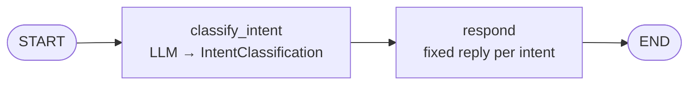
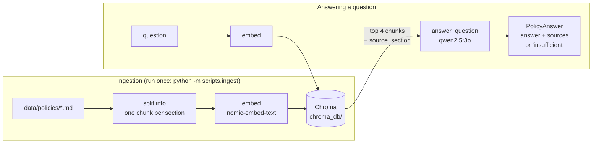

# Agentic Customer Support Assistant

An AI customer-support assistant for **VoltCart**, a fictional online electronics store. When finished, it will answer policy questions from company documents (RAG), look up orders using tools, and hand the conversation to a human when it should. It is built with **LangChain, LangGraph, Pydantic and FastAPI** and runs on a **local LLM through Ollama**, so no paid API key is needed.

The project is built in small milestones. Each one is planned, implemented, run, tested, debugged and reviewed before the next one starts. The [development log](#development-log) records what was built and what went wrong along the way.

> **Status:** Milestone 2 of 10 complete. The assistant classifies customer messages through a LangGraph workflow, and a separate RAG pipeline answers policy questions from VoltCart's documents, citing its sources. The two are connected in Milestone 3. See the [roadmap](#roadmap).

---

## Table of contents

- [What the assistant will do](#what-the-assistant-will-do)
- [Tech stack](#tech-stack)
- [Architecture](#architecture)
- [Project structure](#project-structure)
- [Getting started](#getting-started)
- [Configuration](#configuration)
- [How the current code works](#how-the-current-code-works)
- [Testing](#testing)
- [Troubleshooting](#troubleshooting)
- [Development log](#development-log)
- [Roadmap](#roadmap)
- [Out of scope](#out-of-scope)

---

## What the assistant will do

A VoltCart customer sends a message, and the assistant decides what kind of help it needs:

| Customer message | What the assistant does |
|---|---|
| *"What is your return policy?"* | Searches VoltCart's policy documents and answers with the source it used (RAG) |
| *"Where is my order #1042?"* | Calls a tool that looks the order up in a database |
| *"This is the third time I'm asking. I want a person!"* | Creates a support ticket with a summary and hands off to a human |
| *"And what about my other order?"* | Uses the earlier conversation to understand the follow-up |

It also escalates to a human when it **cannot find a reliable answer**, rather than guessing.

---

## Tech stack

| Technology | Role in this project | Status |
|---|---|---|
| **Python 3.11** | Language | ✅ In use |
| **Ollama + `qwen2.5:3b`** | Runs the chat LLM locally on the CPU, free and offline | ✅ In use |
| **Ollama + `nomic-embed-text`** | Local embedding model: turns text into vectors for search | ✅ In use |
| **LangChain** | Building blocks: chat model interface, structured output, tools, document loaders, retrievers | ✅ In use (chat model, prompts, structured output, text splitters, embeddings, Chroma wrapper) |
| **Pydantic** | Validated data models for settings, LLM outputs, tool inputs and API requests/responses | ✅ In use (settings, LLM output schemas, graph state, retrieved chunks) |
| **LangGraph** | Orchestrates the workflow: classify, route, act, answer or escalate | ✅ In use (2-node graph) |
| **Chroma** | Local vector store for document search (RAG), saved to disk | ✅ In use |
| **pytest** | Automated tests | ✅ In use |
| **SQLite** | Mock order database and support tickets | ⏳ Milestones 4–5 |
| **FastAPI** | HTTP API that exposes the assistant | ⏳ Milestone 7 |

---

## Architecture

The target design is below. **Most of it is not built yet.** Each milestone adds one piece.

```
   Client (curl / Swagger UI / CLI)
                 │
                 ▼
   ┌──────────────────────────────┐
   │ FastAPI                      │  POST /chat, GET /tickets
   │ (Pydantic request/response)  │
   └──────────────┬───────────────┘
                  ▼
   ┌──────────────────────────────┐
   │ LangGraph support workflow   │◄── Checkpointer (conversation memory)
   └──┬──────────┬──────────┬─────┘
      │          │          │
      ▼          ▼          ▼
   LLM via    Retriever   Tools ─────────► Order database (SQLite)
   LangChain     │          │
   (Ollama)      ▼          └─ create_ticket ► Tickets (SQLite)
          Vector store (Chroma)
                 ▲
          Ingest script ◄── VoltCart policy documents (markdown)
```

### Planned LangGraph workflow


The graph grows in stages. **The current graph (Milestone 1)** is the first, simplest version:



### The RAG pipeline (Milestone 2, standalone)

The RAG pipeline is built and tested **on its own**. It is not yet a node in the graph; Milestone 3 connects it.



---

## Project structure

```
agentic-customer-support/
├── app/                  # Application code (the importable Python package)
│   ├── __init__.py       # Marks app/ as a package so `from app... import` works
│   ├── config.py         # Settings: reads .env and validates it with Pydantic
│   ├── llm.py            # get_llm(): the single place where the LLM is created
│   ├── schemas.py        # Pydantic models: IntentClassification, RetrievedChunk, PolicyAnswer
│   ├── classifier.py     # Prompt + LLM that turns a message into an IntentClassification
│   ├── graph.py          # LangGraph workflow: state, nodes and build_graph()
│   ├── vector_store.py   # Embedding model + Chroma collection, shared by ingestion and retrieval
│   ├── ingest.py         # Load policy docs → split into chunks → embed → store
│   ├── retriever.py      # Question → most relevant chunks with source and section
│   └── answer.py         # Question + chunks → answer with sources, or "insufficient information"
├── data/
│   └── policies/         # VoltCart policy documents: shipping, returns, warranty, payments, account
├── scripts/
│   ├── hello_llm.py      # Smoke test: makes one real call to the LLM
│   ├── chat.py           # Command-line chat: type a message, see intent and reply
│   ├── ingest.py         # Builds the vector store from data/policies/
│   └── ask.py            # Ask a policy question; shows retrieved chunks and the answer
├── tests/
│   ├── test_llm.py              # Unit test: the LLM is configured from settings
│   ├── test_graph.py            # Unit tests: graph wiring and schema validation (fake classifier, no LLM)
│   ├── test_ingest.py           # Unit tests: chunking, metadata, no duplicates on re-ingest (fake embeddings)
│   ├── test_retriever.py        # Unit test: retrieved chunks carry source and section (fake embeddings)
│   ├── test_answer.py           # Unit tests: source filtering and "insufficient" handling (fake answer chain)
│   ├── test_classifier_llm.py   # Real-model tests: classification accuracy (run with -m llm)
│   └── test_rag_llm.py          # Real-model tests: retrieval and answers on the real documents (-m llm)
├── .env.example          # Template for your local .env (committed to git)
├── .gitignore            # Keeps .env, .venv/ and caches out of git
├── pytest.ini            # pytest configuration
├── requirements.txt      # Pinned Python dependencies
└── README.md             # This file
```

These files are created locally and **never committed**:

| Path | What it is |
|---|---|
| `.venv/` | The project's private Python environment with all dependencies installed |
| `.env` | Your local settings, copied from `.env.example`. Hosted LLM API keys would go here too, so it is never committed |
| `chroma_db/` | The vector store built by `python -m scripts.ingest`. It is rebuilt from `data/policies/`, so it doesn't need to be in git |

---

## Getting started

### Prerequisites

| Requirement | Notes |
|---|---|
| **Python 3.11** | 3.12 also works. Very new releases (3.14) may not be supported by every LangChain dependency yet |
| **Ollama** | Download from <https://ollama.com/download> |
| **About 2.5 GB of disk** | For the `qwen2.5:3b` model (1.9 GB) and the `nomic-embed-text` embedding model (about 270 MB) |
| **8 GB RAM** | Enough for a 3B-parameter model on the CPU. A GPU is not required |

### 1. Clone the repository

```bash
git clone https://github.com/hmadhe/agentic-customer-support.git
cd agentic-customer-support
```

### 2. Create and activate a virtual environment

A virtual environment keeps this project's packages separate from every other Python project on your machine.

```powershell
# Windows (PowerShell)
py -3.11 -m venv .venv
.\.venv\Scripts\Activate.ps1
```

```bash
# macOS / Linux
python3.11 -m venv .venv
source .venv/bin/activate
```

Your prompt should now start with `(.venv)`.

> **Windows tip:** if PowerShell says *"running scripts is disabled on this system"*, run `Set-ExecutionPolicy -Scope CurrentUser RemoteSigned` once, then activate again.

### 3. Install dependencies

```bash
pip install -r requirements.txt
```

### 4. Download the models

Make sure Ollama is running (open the Ollama app, or run `ollama serve`), then:

```bash
ollama pull qwen2.5:3b          # chat model
ollama pull nomic-embed-text    # embedding model for RAG
ollama list                     # both should appear
```

### 5. Create your `.env` file

```powershell
# Windows
Copy-Item .env.example .env
```

```bash
# macOS / Linux
cp .env.example .env
```

The defaults work as they are. See [Configuration](#configuration) to change them.

### 6. Run the smoke test

Run this **from the project root**, using `-m`:

```bash
python -m scripts.hello_llm
```

Expected output (the exact wording may vary):

```
Model: qwen2.5:3b @ http://localhost:11434
Response: Hello! Welcome to VoltCart. How can I assist you today?
Latency: 4.0s
Tokens: {'input_tokens': 52, 'output_tokens': 15, 'total_tokens': 67}
```

The **first run after starting Ollama is much slower** (about 30 seconds) because the model is loaded into memory. Later runs take a few seconds.

### 7. Run the tests

```bash
python -m pytest -v
```

Expected: `20 passed, 36 deselected`. The 36 deselected tests call real models and are skipped by default. See [Testing](#testing).

### 8. Chat with the assistant

```bash
python -m scripts.chat
```

```
VoltCart support (type 'quit' to exit)

You: Where is my order #1042?
  [intent=order_issue sentiment=neutral order_id=1042]
Bot: I can help with your order. Let me check its details.

You: How long does shipping take?
  [intent=policy_question sentiment=neutral order_id=None]
Bot: Good question about our policies. I'll look that up for you.
```

The line in brackets shows how the LLM classified the message. The reply is a fixed placeholder for now; real answers arrive with RAG and tools in later milestones. Each message takes about 4 seconds on a CPU.

### 9. Build the policy vector store and ask a question

```bash
python -m scripts.ingest
python -m scripts.ask "How much is express shipping?" "Do you offer price matching?"
```

Ingestion only needs to run again when a document in `data/policies/` changes. Actual output:

```
Stored 31 chunks. Collection now holds 31 chunks.

Q: How much is express shipping?
   retrieved 0.714  shipping.md > Shipping options and costs
   retrieved 0.581  shipping.md > Where we ship
   retrieved 0.570  shipping.md > Shipping to Canada
   retrieved 0.566  shipping.md > Tracking your order
A: $14.99
   answered=True sources=['shipping.md']

Q: Do you offer price matching?
   retrieved 0.627  payments.md > Currency and taxes
   retrieved 0.616  payments.md > When you are charged
   retrieved 0.609  payments.md > Accepted payment methods
   retrieved 0.604  shipping.md > Tracking your order
A: I'm sorry, I don't have VoltCart policy information that answers this question. A member of our support team can help.
   answered=False sources=[]
```

The second question shows two things. The retriever **always returns 4 chunks, even when none of them is relevant**, and the answer step is what recognises that they don't answer the question.

---

## Configuration

All settings live in `.env` and are loaded by [`app/config.py`](app/config.py).

| Variable | Default | Meaning |
|---|---|---|
| `OLLAMA_BASE_URL` | `http://localhost:11434` | Where the Ollama server is listening |
| `OLLAMA_MODEL` | `qwen2.5:3b` | Which local model to use. It must already be pulled with `ollama pull` |
| `LLM_TEMPERATURE` | `0` | Randomness of the replies. `0` gives the most consistent output, which helps when testing |
| `MAX_OUTPUT_TOKENS` | `512` | Hard limit on how many tokens the LLM may generate. It stops runaway generations (see the [Milestone 2 log](#milestone-2-standalone-rag-pipeline-)) |
| `OLLAMA_EMBEDDING_MODEL` | `nomic-embed-text` | Embedding model for RAG. **If you change it, re-run `python -m scripts.ingest`** |
| `RETRIEVAL_K` | `4` | How many chunks the retriever returns per question |

**Where settings come from**, highest priority first:

1. **Environment variables** set in your terminal, for example `$env:OLLAMA_MODEL="llama3.2:3b"` in PowerShell or `export OLLAMA_MODEL=llama3.2:3b` in bash
2. **The `.env` file**
3. **Defaults written in `app/config.py`**

So you can try another model once without editing any file.

**API keys:** Ollama runs on your own machine, so **no API key is needed**. If the project later moves to a hosted LLM provider, its key would go in `.env`, which is already git-ignored, and would be added as a field in `Settings`.

---

## How the current code works

### `app/config.py`: settings

A Pydantic `BaseSettings` class reads values from environment variables and `.env`, converts them to the right types (for example `"0"` becomes `0.0`) and fails early with a clear error if a value is invalid. The path to `.env` is built from the project root, so it loads correctly from any working directory.

### `app/llm.py`: the LLM factory

`get_llm()` returns a LangChain `ChatOllama` chat model built from the settings. **This is the only file that knows we use Ollama.** Everything else will call `get_llm()`, so switching providers later means changing one function.

It also takes an optional `settings` argument. Tests use it to pass custom settings without touching `.env`.

### `scripts/hello_llm.py`: the smoke test

It makes one real request to the model, then prints the reply, the time it took and the token counts. Its job is to prove that everything works end to end: Python, the virtual environment, settings, LangChain, Ollama and the model.

### `app/schemas.py`: the contract for LLM output

`IntentClassification` is a Pydantic model with three fields:

| Field | Type | Values |
|---|---|---|
| `intent` | `Intent` enum | `policy_question`, `order_issue`, `human_request`, `greeting`, `out_of_scope` |
| `sentiment` | `Sentiment` enum | `positive`, `neutral`, `negative` |
| `order_id` | text or `None` | Digits only, for example `"1042"` |

Because `intent` is an enum, the rest of the code can rely on it being one of exactly five values. Routing never has to handle free text like *"I think this is about shipping"*.

There is deliberately **no `confidence` field**. A small model's self-reported confidence (for example, "0.92") is not calibrated: it's a number the model makes up, so routing on it would look smart but be unreliable.

### `app/classifier.py`: message → classification

The classifier is a LangChain chain: `prompt | llm.with_structured_output(IntentClassification)`.

- **The prompt** defines each intent and adds tie-break rules for the cases the model got wrong during development (see the [development log](#development-log)).
- **`with_structured_output`** sends the Pydantic schema to Ollama, which uses **constrained decoding**: while generating, the model can only produce tokens that match the schema. So the output is always valid JSON with a valid intent. The model can still pick the *wrong* intent, but never an *invalid* one. The result is then parsed into an `IntentClassification` object.

### `app/graph.py`: the LangGraph workflow

- **`SupportState`** is a Pydantic model holding the data that flows through the graph: the customer `message`, the `classification` and the `response`. Each node returns **only the fields it changes**, and LangGraph merges them into the state.
- **`classify_intent`** calls the classifier and stores its result.
- **`respond`** looks up a fixed reply for the intent. It will be replaced by real RAG, tool and escalation branches in later milestones.
- **`build_graph(classifier=None)`** connects `START → classify_intent → respond → END` and compiles the graph. You can pass in a different classifier, which is how the tests swap in a fake one so they don't need the LLM.

> **Gotcha:** the state is a Pydantic model, but `graph.invoke(...)` returns a plain **dict**. Use `result["response"]`, not `result.response`.

### `scripts/chat.py`: command-line chat

A loop that reads a message, runs the graph and prints the classification and the reply.

### RAG: why each piece exists

An LLM on its own doesn't know VoltCart's policies, so it would invent them. **RAG (Retrieval-Augmented Generation)** finds the relevant policy text first and gives it to the LLM with an instruction to answer *only* from that text.

| Piece | Why it exists |
|---|---|
| `data/policies/*.md` | The only source of truth the assistant may answer from. They use specific numbers (days, fees, amounts), which makes invented details easy to spot |
| `app/vector_store.py` | One place that defines the embedding model and the Chroma collection, so ingestion and retrieval can never use different settings |
| `app/ingest.py` | Prepares the documents for search: split, embed, store. It runs once, not on every question |
| `app/retriever.py` | Finds the chunks most similar in meaning to a question |
| `app/answer.py` | Writes the answer from those chunks only, cites the sources, and admits when the chunks don't answer the question |

### `app/vector_store.py`: embeddings and Chroma

- **Embeddings** turn text into a list of numbers (a vector) so that texts with similar meaning get similar vectors. We use `nomic-embed-text` through Ollama.
- **`NomicEmbeddings`** adds the task prefixes this model was trained with: `search_document: ` on stored chunks and `search_query: ` on questions. Without them, the chunk that actually answers "My laptop stopped working after 6 months" wasn't in the top 4 results; with them, it ranks 2nd.
- **Chroma** stores the vectors on disk in `chroma_db/`. It is set to **cosine similarity**, so relevance scores run from 0 to 1 and are easy to compare.

### `app/ingest.py`: how ingestion works

1. **Load:** read every `.md` file in `data/policies/` and tag it with its file name (`source`).
2. **Split:** use `MarkdownHeaderTextSplitter` to make **one chunk per `##` section**. Each chunk's text starts with `<document title> > <section>`, for example `VoltCart Returns and Refunds Policy > Restocking fee`, and its metadata holds `source` and `section`. A section longer than 500 characters would be split again with 50 characters of overlap. None of ours is: the 31 chunks are 96–386 characters.
3. **Reset:** empty the Chroma collection, so running ingestion again never creates duplicates and chunks from deleted documents disappear.
4. **Embed and store:** `add_documents` embeds every chunk and saves it with its metadata.

**Why section chunks?** The first version used plain 500-character chunks. Inspecting them showed headings stranded at the end of a chunk with none of their text, chunks that mixed two topics, and chunks that didn't say which policy they came from. Section chunks are one complete topic each.

### `app/retriever.py`: how retrieval works

`retrieve(question)` embeds the question, asks Chroma for the 4 most similar chunks, and returns them as `RetrievedChunk` objects with `text`, `source`, `section` and a relevance `score`, best match first.

Retrieval **always returns 4 chunks**, even when none is relevant. Unanswerable questions scored up to 0.535 while correct answers started at 0.575 (before the prefixes). That gap is too small for a reliable cutoff, so recognising "not relevant" is left to the answer step.

### `app/answer.py`: how the answer function works

`answer_question(question, chunks)` returns a `PolicyAnswer` with `answered`, `answer` and `sources`.

1. **No chunks:** return the fixed "insufficient information" reply without calling the LLM.
2. **Prompt:** the chunks are pasted in, each labelled `[source: returns.md]`. The rules are: use only these excerpts, never add numbers or rules, set `answered` to false if they don't contain the answer, and list the files used.
3. **Structured output:** the LLM fills a `PolicyAnswer`. `answered` comes first, so the model decides *whether* it can answer before writing anything. `sources` is a **required** field; when it was optional, the model left it empty in 3 of 4 answers.
4. **Safety checks in code**, which don't depend on the model behaving:
   - if `answered` is false, the model's own text is replaced with the fixed reply, because qwen sometimes writes things like *"Price matching is not offered"*, a policy claim it can't support
   - any source that wasn't actually retrieved is removed
   - if the output can't be parsed (for example, a runaway generation cut off at `MAX_OUTPUT_TOKENS`), the fixed reply is returned instead of crashing

### `scripts/ingest.py` and `scripts/ask.py`

`ingest` builds the vector store. `ask` retrieves chunks for one or more questions and answers them, printing each retrieved chunk's score, source and section so you can see *why* an answer was given.

---

## Testing

There are two kinds of tests:

| Kind | Files | Needs Ollama? | Speed | Command | Result now |
|---|---|---|---|---|---|
| **Unit tests** | `test_llm.py`, `test_graph.py`, `test_ingest.py`, `test_retriever.py`, `test_answer.py` | No (fakes) | About 5 seconds | `python -m pytest` | 20 passed |
| **Real-model tests** | `test_classifier_llm.py`, `test_rag_llm.py` | Yes | About 2.5 minutes | `python -m pytest -m llm` | 34 passed, 2 xfailed |

**Unit tests** check *our* code, using fakes so they're fast and give the same result every time:
- **Classifier and graph:** a fake classifier that always returns a fixed answer.
- **Ingestion and retrieval:** a **small controlled dataset** (Markdown files written into a temporary folder) and LangChain's `DeterministicFakeEmbedding`, where identical text always gives an identical vector. They check that each section becomes one chunk with the right `source` and `section`, that long sections keep their heading, that re-ingesting never duplicates chunks, that deleted documents disappear, and that retrieved chunks carry their metadata.
- **Answering:** a fake answer chain. It checks that unretrieved sources are removed, that an unanswered result gets the fixed reply (using a real qwen output as the example), that no chunks means no LLM call, and that unparseable output doesn't crash.

**Real-model tests** check *the models' behaviour*:
- **Classifier:** 14 messages with expected intents, order-ID extraction and negative sentiment, including **regression cases** the model once got wrong.
- **Retrieval:** 11 questions, each checking the **document ranked first** *and* that the **specific section** that answers it is in the top 4. They run against a fresh vector store built in a temporary folder, so they don't depend on your local `chroma_db/`.
- **Answers:** 3 questions whose answers must contain the right fact (`14.99`, `15%`, `150`) and cite the right document, plus 3 questions **no document answers**, which must get the "insufficient information" reply.

**What `xfail` means:** two tests are marked *expected to fail*, because they describe known limitations we chose not to hide (see the [Milestone 2 log](#milestone-2-standalone-rag-pipeline-)). pytest runs them and reports `XFAIL`. If one starts passing, for example after a model upgrade, pytest reports `XPASS`.

**Passing tests don't prove the RAG is accurate.** They cover 11 retrieval questions and 6 answer questions, all written by hand. Accuracy on a larger set of questions is measured in Milestone 9.

**How the split works:** `pytest.ini` marks real-model tests with `llm` and skips them by default (`addopts = -m "not llm"`). Running `pytest -m llm` overrides that. `pythonpath = .` lets tests `import app` from the project root.

**Rule of thumb:** after changing the **prompt**, run `pytest -m llm`, because a fix for one message can break another.

---

## Troubleshooting

Each problem below was hit or reproduced during development.

| Error | Cause | Fix |
|---|---|---|
| `ModuleNotFoundError: No module named 'app'` when running `python scripts/hello_llm.py` | Running a file by its path puts **its folder** (`scripts/`) on Python's import path, not the project root | Run it as a module from the project root: `python -m scripts.hello_llm` |
| `httpx.ConnectError: [WinError 10061] No connection could be made because the target machine actively refused it` | Ollama isn't running, or `OLLAMA_BASE_URL` points to the wrong address or port | Start the Ollama app or run `ollama serve`, and check `OLLAMA_BASE_URL` in `.env` |
| `ollama._types.ResponseError: model 'xyz' not found (status code: 404)` | The model in `OLLAMA_MODEL` hasn't been downloaded | Run `ollama pull <model>` and check with `ollama list` |
| `Error: listen tcp 127.0.0.1:11434: bind: Only one usage of each socket address ...` from `ollama serve` | Ollama is **already running**, usually started by the desktop app | Nothing to fix. Use the server that is already running |
| The first LLM call takes about 30 seconds | Cold start: Ollama is loading the model into RAM. It unloads it again after about 5 minutes idle | Expected. Later calls take about 4 seconds |
| The classifier picks a wrong but valid intent | Usually two intent definitions in the prompt overlap, so the model matches on keywords | Probe several similar messages to confirm a pattern, sharpen the definitions in `app/classifier.py`, add the messages to `tests/test_classifier_llm.py`, and run `pytest -m llm` |
| `AttributeError: 'dict' object has no attribute 'response'` | `graph.invoke()` returns a dict, even though the state is a Pydantic model | Use `result["response"]` |
| The same chunk appears twice in the retrieved results | Ingestion ran more than once with an older version that only added chunks | Fixed: ingestion now empties the collection first. Re-run `python -m scripts.ingest` |
| Retrieval suddenly gets worse with no error | The embedding setup changed (model or prefixes) but the stored vectors are still the old ones | Re-run `python -m scripts.ingest` after any embedding change |
| `scripts.ask` returns nothing useful, or the collection holds 0 chunks | Ingestion failed partway through (for example, Ollama stopped) after the collection was emptied | Start Ollama and re-run `python -m scripts.ingest` |
| A question takes about a minute and gets the "insufficient information" reply | qwen fell into a **runaway generation** and was cut off at `MAX_OUTPUT_TOKENS`, so its output couldn't be parsed | Expected occasionally with this small model. Before the cap, one runaway took 8 minutes |

---

## Development log

Every milestone follows the same cycle:

**Plan → Implement a small feature → Run → Test → Debug → Fix → Review → Identify missing pieces → Next milestone**

### Milestone 0: setup and first LLM call ✅

**Goal:** prove that the whole toolchain works before writing any assistant logic.

**Built:**
- Python 3.11 virtual environment with 4 pinned dependencies (`langchain-core`, `langchain-ollama`, `pydantic-settings`, `pytest`)
- Settings validated by Pydantic and loaded from `.env`, with a committed `.env.example`
- The `get_llm()` factory for a local `qwen2.5:3b` model
- A smoke-test script that made a real LLM call successfully
- A pytest setup with one unit test, which passes

**Problems hit and how they were fixed:**
1. **`ollama serve` failed with "bind: Only one usage of each socket address".** A server was already running on port 11434. This was harmless; we used the existing server.
2. **`ModuleNotFoundError: No module named 'app'`.** We had run the script by its file path. Running it as a module (`python -m scripts.hello_llm`) fixed it without changing any code.
3. **The first call took 28.9 seconds.** We measured a second run (4.0 s) and confirmed it was model loading, not a bug.
4. **The first `git push` was rejected (`fetch first`).** The GitHub repo had been created with a README commit. We rebased our commit on top of it instead of force-pushing, so nothing was overwritten.

**Known limitations:**
- **CPU-only, 8 GB RAM.** Short replies take about 4 seconds, long ones much longer. LLM-heavy evaluation will be slow.
- **The 3B model is small.** Structured output and tool calling will sometimes fail, so later milestones need validation and retries.
- **The context window is 4096 tokens by default.** RAG chunks and chat history will have to fit inside it, though it can be raised later.
- **Ollama must be running** before the app is started.

### Milestone 1: intent classifier and first LangGraph graph ✅

**Goal:** turn a customer message into a validated, structured classification and route it through a LangGraph workflow.

**Built:**
- Pydantic schemas: the `Intent` and `Sentiment` enums and the `IntentClassification` model
- A classifier: a prompt plus `with_structured_output`, using Ollama's constrained decoding
- The first LangGraph graph, `START → classify_intent → respond → END`, with a Pydantic state
- A command-line chat (`python -m scripts.chat`)
- 7 new unit tests using a fake classifier, and 16 real-model tests that only run with `-m llm`

**Problems hit and how they were fixed:**
1. **Off-topic questions were classified as `greeting`.** "What's the capital of France?", "What's the weather tomorrow?" and "Write me a poem" all became `greeting`. Probing 5 off-topic messages showed a pattern (3 of 5 wrong), not a one-off. **Cause:** `greeting` was defined as "a greeting *or small talk*", and casual questions count as small talk. **Fix:** narrowed `greeting` to "ONLY hi, thanks or bye", gave `out_of_scope` concrete examples, and added the rule "a message with a question or request is never a greeting". Result: 5 of 5 correct.
2. **General shipping questions were classified as `order_issue`.** "How long does shipping take?" failed in the new tests, and 4 of 5 similar questions failed the same way (the same answer 3 out of 3 times, so it wasn't random). **Cause:** `order_issue` mentioned "delivery" and `policy_question` mentioned "shipping", so the small model matched on keywords. The real deciding question, "does the customer refer to *their own* order?", was only implied. **Fix:** said it explicitly ("THEIR OWN order: an order number, 'my order', 'my package'…") and added it as a rule. Result: 8 of 8 correct, including "My package still hasn't arrived" (no order number).
3. **The expected invalid-output errors never happened.** I'd predicted the 3B model would sometimes return invalid intents or broken JSON. Investigating why it didn't showed that `with_structured_output` passes the schema to Ollama, which restricts generation to valid output. **Lesson:** with this setup, failures are about meaning (a valid but wrong intent), not structure.

**What we learned:** both real bugs were **prompt ambiguity**, not code bugs. The method that worked: notice one failure, probe similar messages to find the pattern, fix the definition, then re-run *every* real-model test, because a prompt change can break other cases.

**Known limitations and open questions:**
- **Replies are placeholders.** `respond` returns a fixed sentence per intent.
- **Angry customers are classified as `human_request`** even when they don't ask for a human (for example, "This is the third time I'm asking, your service is terrible!"). The `sentiment` field is correct (`negative`), so the escalation rules in Milestone 5 can use it directly.
- **No error handling.** If Ollama stops, the chat crashes with a raw error.
- **The tests are a small sample** (14 intent cases). Real accuracy will be measured on a larger dataset in Milestone 9.
- **Each message is classified on its own.** There's no memory of earlier messages until Milestone 6.
- **About 4 seconds per message** on the CPU.

### Milestone 2: standalone RAG pipeline ✅

**Goal:** answer VoltCart policy questions from our own documents, citing the source and refusing when the documents don't contain the answer. It is built and tested on its own and is not yet connected to the graph.

**Built:**
- 5 policy documents (`data/policies/`): shipping, returns, warranty, payments, account. Some topics deliberately overlap ("damaged item" in returns and warranty, "change address" in account and shipping) to make retrieval realistic.
- Local embeddings (`nomic-embed-text` via Ollama) and a Chroma vector store on disk
- Ingestion (one chunk per section, with `source` and `section` metadata), a retriever and an answer function with structured output
- CLI scripts: `scripts.ingest` and `scripts.ask`
- 12 new unit tests and 20 new real-model tests

**Investigations, with the actual numbers:**

1. **Chunk size and overlap.** The first version used 500-character chunks with 50 characters of overlap and produced 19 chunks. Inspecting them showed headings stranded at the end of a chunk with none of their text, the overlap mostly copying those stranded headings, and chunks mixing two topics. I switched to **one chunk per section** (31 chunks, 96–386 characters).
   On 15 test questions, **the retrieval ranking did not change**: 14 of 15 put the right document first both before and after. The change is kept for the *answer* step, because each chunk is now one complete topic with its section name. I'm not claiming it improved retrieval.

2. **Duplicates on re-ingestion.** Running ingestion twice took the collection from 19 to **38 chunks**. Asking "What is the restocking fee for a laptop?" then returned **only 2 unique chunks out of 4**: half the context was wasted on copies. **Fix:** empty the collection before each ingestion (`reset_collection`). After the fix, two runs still give 31 chunks. I chose this over stable IDs plus updating in place because updating in place would leave stale chunks behind when a document gets shorter.

3. **Irrelevant chunks.** Retrieval always returns 4 chunks, even for questions no document answers:

   | Question type | Top relevance score (before prefixes) |
   |---|---|
   | Answerable (15 questions) | 0.575 – 0.830 |
   | Unanswerable ("price matching", "student discount", "store pickup") | 0.501 – 0.535 |

   The gap is only about 0.04, so a score cutoff would be fragile. Instead, the **answer step** must recognise unhelpful context, and in all 3 unanswerable test questions it did.

4. **Context window.** I measured the real answer prompt (system prompt plus 4 chunks plus the question) on all 18 questions with Ollama's own token count: **298–392 input tokens, at most about 10% of the 4096-token window.** Plenty of room.

**Problems hit and how they were fixed:**

1. **A retrieval miss hidden by the metric.** "My laptop stopped working after 6 months" had `warranty.md` in the top 4, so a document-level check passed. But the section that actually answers it, **"Manufacturer warranty", wasn't in the top 4 at all**; the warranty chunks there were "Protection Plan" and "Refurbished products". "Return window" ranked first because it shares the word "laptop".
   **Fix:** the `nomic-embed-text` model card says to use the task prefixes `search_document:` and `search_query:`, and we weren't. With them, "Manufacturer warranty" ranks **2nd**. The top-ranked result is still "Return window", now a known limitation (see below). Retrieval tests now check the **section**, not just the document.
2. **Answers with no sources.** 3 of 4 answered questions came back with `sources=[]`. I checked the model's raw output: it really was returning an empty list, so my filter wasn't the cause. The real cause: `sources` had a default value, which made it **optional** in the JSON schema sent to Ollama, and the model took the shortest valid output. **Fix:** made `sources` a required field. Result: all 4 cite the right document.
3. **Runaway generation.** One answer generated **3,544 tokens and took 8 minutes 16 seconds** (a normal answer is about 50–100 tokens). It happened again on a later run (3,318 tokens). Nothing stopped it, because Ollama's default output limit is unlimited.
   **Fix:** `MAX_OUTPUT_TOKENS=512`, plus treating unparseable output as "insufficient information" instead of crashing.
   **Still unexplained:** it's intermittent. The same question ran normally 5 times in a row in isolation, and only ran away after other questions in the same process. Ollama's log shows it reusing cached prompt tokens from the previous request, which is a plausible cause, but I haven't proven it. It also shows that **temperature 0 is not fully deterministic** here.
4. **A hallucination from mixing two chunks (not fixed).** For "My laptop stopped working after 6 months", qwen answers *"VoltCart will handle the repair or replacement for free"*. **That's false:** the policy says *"The manufacturer handles these repairs."* The "repair or replace for free" wording comes from the separately retrieved "Refurbished products" chunk. It happens on every run. Three fixes were tried and measured:

   | Attempt | Result |
   |---|---|
   | Prompt rule: "each excerpt applies only to its own situation" | **Worse.** It also invented "a 15% restocking fee if not covered" and cited the wrong document |
   | Schema with a `quote` field before `answer` (quote first, then answer) | **Worse.** It invented a quote ("can be returned or *exchanged*"; the policy says *no* exchanges) and ran away twice |
   | A larger hosted model (Gemini) | **Fixed it**, correctly saying "the manufacturer handles these repairs". Not adopted: the project stays fully local (and the free tier allowed only 20 requests per day for that model) |

   **Conclusion:** this is a limit of the 3B model, not something prompting fixes. It stays as a visible `xfail` test.

**What we learned:**
- **Inspect before tuning.** Reading the actual chunks found the chunking problems, and reading the model's raw output showed the missing sources weren't caused by my filter.
- **Measure each change on its own.** Section chunking did *not* improve ranking, and I'd have claimed it did without the before and after numbers.
- **The schema is part of the prompt.** Making one field optional changed the model's behaviour.
- **Every prompt fix can make things worse:** 2 of 3 hallucination fixes did. Run the real-model tests after each one.
- **Always cap output length.** One runaway blocked the app for 8 minutes.

**Known limitations:**
- **The laptop-warranty hallucination** (above). For questions where several retrieved chunks sound alike, qwen may mix them.
- **Top-ranked result for "laptop stopped working":** "Return window" (because of the shared word "laptop"). Reranking or hybrid keyword search could fix it, but both are out of scope for now.
- **Runaway generations** still happen occasionally. They now cost about a minute and give an "insufficient information" reply instead of an answer.
- **"Insufficient information" covers two cases:** the policies really don't answer the question, or the model's output was unusable. The customer sees the same message either way.
- **Retrieval can't tell "nothing relevant" from "relevant"** by score. Only the answer step can.
- **If ingestion fails partway, the store is left empty** until it is re-run.
- **Answers can be very terse** ("$14.99", "15%"). They're correct but not friendly.
- **The test sample is small** (11 retrieval and 6 answer questions, written by hand), and answer tests check for one key fact, not the full text.
- **Not connected to the graph yet.** That's Milestone 3.

---

## Roadmap

| # | Milestone | What it adds | Status |
|---|---|---|---|
| 0 | Setup | Project skeleton, settings, first LLM call, pytest | ✅ Done |
| 1 | Intent classifier and first graph | Pydantic structured output, LangGraph `classify_intent → respond` | ✅ Done |
| 2 | RAG pipeline | Policy documents, chunking, embeddings, Chroma, answers with sources | ✅ Done |
| 3 | Routing | Conditional edges: policy questions go to RAG, other messages go to a fallback | ⏳ Next |
| 4 | Tool calling | SQLite order database, order-status and return-eligibility tools, agent ⇄ tools loop | ⬜ |
| 5 | Human escalation | Escalation rules, support tickets, fallback when an answer isn't grounded | ⬜ |
| 6 | Conversation memory | LangGraph checkpointer, multi-turn conversations per thread | ⬜ |
| 7 | FastAPI | `/chat` and `/tickets` endpoints with Pydantic request/response models | ⬜ |
| 8 | Testing | Unit tests for tools and routing (fake LLM), API tests | ⬜ |
| 9 | Evaluation | Golden dataset, routing, retrieval and escalation metrics, results report | ⬜ |
| 10 | Polish | Final docs, diagrams, demo | ⬜ |

---

## Out of scope

These are left out on purpose, to keep the project focused on AI engineering rather than infrastructure:

- Authentication, user accounts and rate limiting
- A custom frontend (FastAPI's built-in Swagger UI at `/docs` is the demo UI)
- Multi-agent hierarchies (one graph with branches is the right size)
- Hosted vector databases, Postgres, Redis or message queues (Chroma and SQLite are enough)
- Docker or Kubernetes deployment
- Real integrations such as Zendesk or Shopify (mock tools demonstrate the same skills)
- Advanced RAG (rerankers, hybrid search), unless the evaluation shows it is needed
