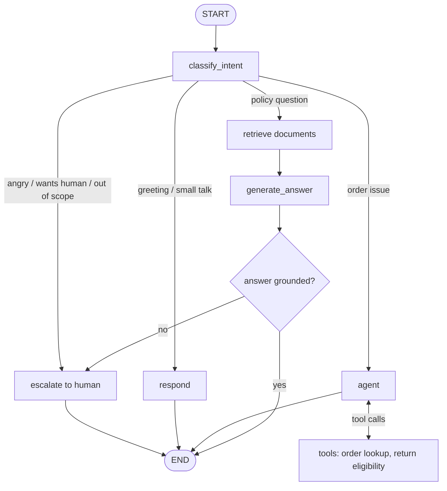

# Agentic Customer Support Assistant

An AI customer-support assistant for **VoltCart**, a fictional online electronics store. When finished, it will answer policy questions from company documents (RAG), look up orders using tools, and hand the conversation to a human when it should. It is built with **LangChain, LangGraph, Pydantic and FastAPI** and runs on a **local LLM through Ollama**, so no paid API key is needed.

The project is built in small milestones. Each one is planned, implemented, run, tested, debugged and reviewed before the next one starts. The [development log](#development-log) records what was built and what went wrong along the way.

> **Status:** Milestone 1 of 10 complete. The assistant classifies customer messages with an LLM and routes them through a LangGraph workflow. See the [roadmap](#roadmap).

---

## Table of contents

- [What the assistant will do](#what-the-assistant-will-do)
- [Tech stack](#tech-stack)
- [Architecture](#architecture)
- [Project structure](#project-structure)
- [Getting started](#getting-started)
- [Configuration](#configuration)
- [How the current code works](#how-the-current-code-works)
- [Testing](#testing)
- [Troubleshooting](#troubleshooting)
- [Development log](#development-log)
- [Roadmap](#roadmap)
- [Out of scope](#out-of-scope)

---

## What the assistant will do

A VoltCart customer sends a message, and the assistant decides what kind of help it needs:

| Customer message | What the assistant does |
|---|---|
| *"What is your return policy?"* | Searches VoltCart's policy documents and answers with the source it used (RAG) |
| *"Where is my order #1042?"* | Calls a tool that looks the order up in a database |
| *"This is the third time I'm asking. I want a person!"* | Creates a support ticket with a summary and hands off to a human |
| *"And what about my other order?"* | Uses the earlier conversation to understand the follow-up |

It also escalates to a human when it **cannot find a reliable answer**, rather than guessing.

---

## Tech stack

| Technology | Role in this project | Status |
|---|---|---|
| **Python 3.11** | Language | ✅ In use |
| **Ollama + `qwen2.5:3b`** | Runs the LLM locally on the CPU, free and offline | ✅ In use |
| **LangChain** | Building blocks: chat model interface, structured output, tools, document loaders, retrievers | ✅ In use (chat model, prompt template, structured output) |
| **Pydantic** | Validated data models for settings, LLM outputs, tool inputs and API requests/responses | ✅ In use (settings, LLM output schema, graph state) |
| **LangGraph** | Orchestrates the workflow: classify, route, act, answer or escalate | ✅ In use (2-node graph) |
| **pytest** | Automated tests | ✅ In use |
| **Chroma** | Local vector store for document search (RAG) | ⏳ Milestone 2 |
| **SQLite** | Mock order database and support tickets | ⏳ Milestones 4–5 |
| **FastAPI** | HTTP API that exposes the assistant | ⏳ Milestone 7 |

---

## Architecture

The target design is below. **Most of it is not built yet.** Each milestone adds one piece.

```
   Client (curl / Swagger UI / CLI)
                 │
                 ▼
   ┌──────────────────────────────┐
   │ FastAPI                      │  POST /chat, GET /tickets
   │ (Pydantic request/response)  │
   └──────────────┬───────────────┘
                  ▼
   ┌──────────────────────────────┐
   │ LangGraph support workflow   │◄── Checkpointer (conversation memory)
   └──┬──────────┬──────────┬─────┘
      │          │          │
      ▼          ▼          ▼
   LLM via    Retriever   Tools ─────────► Order database (SQLite)
   LangChain     │          │
   (Ollama)      ▼          └─ create_ticket ► Tickets (SQLite)
          Vector store (Chroma)
                 ▲
          Ingest script ◄── VoltCart policy documents (markdown)
```

### Planned LangGraph workflow



The graph grows in stages. **The current graph (Milestone 1)** is the first, simplest version:


---

## Project structure

```
agentic-customer-support/
├── app/                  # Application code (the importable Python package)
│   ├── __init__.py       # Marks app/ as a package so `from app... import` works
│   ├── config.py         # Settings: reads .env and validates it with Pydantic
│   ├── llm.py            # get_llm(): the single place where the LLM is created
│   ├── schemas.py        # Pydantic models: Intent, Sentiment, IntentClassification
│   ├── classifier.py     # Prompt + LLM that turns a message into an IntentClassification
│   └── graph.py          # LangGraph workflow: state, nodes and build_graph()
├── scripts/
│   ├── hello_llm.py      # Smoke test: makes one real call to the LLM
│   └── chat.py           # Command-line chat: type a message, see intent and reply
├── tests/
│   ├── test_llm.py              # Unit test: the LLM is configured from settings
│   ├── test_graph.py            # Unit tests: graph wiring and schema validation (fake classifier, no LLM)
│   └── test_classifier_llm.py   # Real-model tests: classification accuracy (run with -m llm)
├── .env.example          # Template for your local .env (committed to git)
├── .gitignore            # Keeps .env, .venv/ and caches out of git
├── pytest.ini            # pytest configuration
├── requirements.txt      # Pinned Python dependencies
└── README.md             # This file
```

These files are created locally and **never committed**:

| Path | What it is |
|---|---|
| `.venv/` | The project's private Python environment with all dependencies installed |
| `.env` | Your local settings, copied from `.env.example`. Hosted LLM API keys would go here too, so it is never committed |

---

## Getting started

### Prerequisites

| Requirement | Notes |
|---|---|
| **Python 3.11** | 3.12 also works. Very new releases (3.14) may not be supported by every LangChain dependency yet |
| **Ollama** | Download from <https://ollama.com/download> |
| **About 2 GB of disk** | For the `qwen2.5:3b` model |
| **8 GB RAM** | Enough for a 3B-parameter model on the CPU. A GPU is not required |

### 1. Clone the repository

```bash
git clone https://github.com/hmadhe/agentic-customer-support.git
cd agentic-customer-support
```

### 2. Create and activate a virtual environment

A virtual environment keeps this project's packages separate from every other Python project on your machine.

```powershell
# Windows (PowerShell)
py -3.11 -m venv .venv
.\.venv\Scripts\Activate.ps1
```

```bash
# macOS / Linux
python3.11 -m venv .venv
source .venv/bin/activate
```

Your prompt should now start with `(.venv)`.

> **Windows tip:** if PowerShell says *"running scripts is disabled on this system"*, run `Set-ExecutionPolicy -Scope CurrentUser RemoteSigned` once, then activate again.

### 3. Install dependencies

```bash
pip install -r requirements.txt
```

### 4. Download the LLM

Make sure Ollama is running (open the Ollama app, or run `ollama serve`), then:

```bash
ollama pull qwen2.5:3b
ollama list          # qwen2.5:3b should appear
```

### 5. Create your `.env` file

```powershell
# Windows
Copy-Item .env.example .env
```

```bash
# macOS / Linux
cp .env.example .env
```

The defaults work as they are. See [Configuration](#configuration) to change them.

### 6. Run the smoke test

Run this **from the project root**, using `-m`:

```bash
python -m scripts.hello_llm
```

Expected output (the exact wording may vary):

```
Model: qwen2.5:3b @ http://localhost:11434
Response: Hello! Welcome to VoltCart. How can I assist you today?
Latency: 4.0s
Tokens: {'input_tokens': 52, 'output_tokens': 15, 'total_tokens': 67}
```

The **first run after starting Ollama is much slower** (about 30 seconds) because the model is loaded into memory. Later runs take a few seconds.

### 7. Run the tests

```bash
python -m pytest -v
```

Expected: `8 passed, 16 deselected`. The 16 deselected tests call the real model and are skipped by default. See [Testing](#testing).

### 8. Chat with the assistant

```bash
python -m scripts.chat
```

```
VoltCart support (type 'quit' to exit)

You: Where is my order #1042?
  [intent=order_issue sentiment=neutral order_id=1042]
Bot: I can help with your order. Let me check its details.

You: How long does shipping take?
  [intent=policy_question sentiment=neutral order_id=None]
Bot: Good question about our policies. I'll look that up for you.
```

The line in brackets shows how the LLM classified the message. The reply is a fixed placeholder for now; real answers arrive with RAG and tools in later milestones. Each message takes about 4 seconds on a CPU.

---

## Configuration

All settings live in `.env` and are loaded by [`app/config.py`](app/config.py).

| Variable | Default | Meaning |
|---|---|---|
| `OLLAMA_BASE_URL` | `http://localhost:11434` | Where the Ollama server is listening |
| `OLLAMA_MODEL` | `qwen2.5:3b` | Which local model to use. It must already be pulled with `ollama pull` |
| `LLM_TEMPERATURE` | `0` | Randomness of the replies. `0` gives the most consistent output, which helps when testing |

**Where settings come from**, highest priority first:

1. **Environment variables** set in your terminal, for example `$env:OLLAMA_MODEL="llama3.2:3b"` in PowerShell or `export OLLAMA_MODEL=llama3.2:3b` in bash
2. **The `.env` file**
3. **Defaults written in `app/config.py`**

So you can try another model once without editing any file.

**API keys:** Ollama runs on your own machine, so **no API key is needed**. If the project later moves to a hosted LLM provider, its key would go in `.env`, which is already git-ignored, and would be added as a field in `Settings`.

---

## How the current code works

### `app/config.py`: settings

A Pydantic `BaseSettings` class reads values from environment variables and `.env`, converts them to the right types (for example `"0"` becomes `0.0`) and fails early with a clear error if a value is invalid. The path to `.env` is built from the project root, so it loads correctly from any working directory.

### `app/llm.py`: the LLM factory

`get_llm()` returns a LangChain `ChatOllama` chat model built from the settings. **This is the only file that knows we use Ollama.** Everything else will call `get_llm()`, so switching providers later means changing one function.

It also takes an optional `settings` argument. Tests use it to pass custom settings without touching `.env`.

### `scripts/hello_llm.py`: the smoke test

It makes one real request to the model, then prints the reply, the time it took and the token counts. Its job is to prove that everything works end to end: Python, the virtual environment, settings, LangChain, Ollama and the model.

### `app/schemas.py`: the contract for LLM output

`IntentClassification` is a Pydantic model with three fields:

| Field | Type | Values |
|---|---|---|
| `intent` | `Intent` enum | `policy_question`, `order_issue`, `human_request`, `greeting`, `out_of_scope` |
| `sentiment` | `Sentiment` enum | `positive`, `neutral`, `negative` |
| `order_id` | text or `None` | Digits only, for example `"1042"` |

Because `intent` is an enum, the rest of the code can rely on it being one of exactly five values. Routing never has to handle free text like *"I think this is about shipping"*.

There is deliberately **no `confidence` field**. A small model's self-reported confidence (for example, "0.92") is not calibrated: it's a number the model makes up, so routing on it would look smart but be unreliable.

### `app/classifier.py`: message → classification

The classifier is a LangChain chain: `prompt | llm.with_structured_output(IntentClassification)`.

- **The prompt** defines each intent and adds tie-break rules for the cases the model got wrong during development (see the [development log](#development-log)).
- **`with_structured_output`** sends the Pydantic schema to Ollama, which uses **constrained decoding**: while generating, the model can only produce tokens that match the schema. So the output is always valid JSON with a valid intent. The model can still pick the *wrong* intent, but never an *invalid* one. The result is then parsed into an `IntentClassification` object.

### `app/graph.py`: the LangGraph workflow

- **`SupportState`** is a Pydantic model holding the data that flows through the graph: the customer `message`, the `classification` and the `response`. Each node returns **only the fields it changes**, and LangGraph merges them into the state.
- **`classify_intent`** calls the classifier and stores its result.
- **`respond`** looks up a fixed reply for the intent. It will be replaced by real RAG, tool and escalation branches in later milestones.
- **`build_graph(classifier=None)`** connects `START → classify_intent → respond → END` and compiles the graph. You can pass in a different classifier, which is how the tests swap in a fake one so they don't need the LLM.

> **Gotcha:** the state is a Pydantic model, but `graph.invoke(...)` returns a plain **dict**. Use `result["response"]`, not `result.response`.

### `scripts/chat.py`: command-line chat

A loop that reads a message, runs the graph and prints the classification and the reply.

---

## Testing

There are two kinds of tests:

| Kind | Files | Calls the LLM? | Speed | Command |
|---|---|---|---|---|
| **Unit tests** | `test_llm.py`, `test_graph.py` | No (fake classifier) | About 2 seconds | `python -m pytest` |
| **Real-model tests** | `test_classifier_llm.py` | Yes (needs Ollama) | About 1 minute | `python -m pytest -m llm` |

**Unit tests** check *our* code: the LLM is configured from settings, every intent gets a reply, the graph passes the customer's message to the classifier, and the schema rejects an unknown intent. They use a **fake classifier** that always returns a fixed answer, because real LLM calls are slow, need Ollama running and may not give the same answer every time.

**Real-model tests** check *the model's behaviour*: 14 messages with their expected intents, order-ID extraction and negative-sentiment detection. They include **regression cases**: messages the model got wrong during development, kept so the same bug can't silently come back after a prompt change.

**How the split works:** `pytest.ini` marks real-model tests with `llm` and skips them by default (`addopts = -m "not llm"`). Running `pytest -m llm` overrides that. `pythonpath = .` lets tests `import app` from the project root.

**Rule of thumb:** after changing the **prompt**, run `pytest -m llm`, because a fix for one message can break another.

---

## Troubleshooting

Each problem below was hit or reproduced during development.

| Error | Cause | Fix |
|---|---|---|
| `ModuleNotFoundError: No module named 'app'` when running `python scripts/hello_llm.py` | Running a file by its path puts **its folder** (`scripts/`) on Python's import path, not the project root | Run it as a module from the project root: `python -m scripts.hello_llm` |
| `httpx.ConnectError: [WinError 10061] No connection could be made because the target machine actively refused it` | Ollama isn't running, or `OLLAMA_BASE_URL` points to the wrong address or port | Start the Ollama app or run `ollama serve`, and check `OLLAMA_BASE_URL` in `.env` |
| `ollama._types.ResponseError: model 'xyz' not found (status code: 404)` | The model in `OLLAMA_MODEL` hasn't been downloaded | Run `ollama pull <model>` and check with `ollama list` |
| `Error: listen tcp 127.0.0.1:11434: bind: Only one usage of each socket address ...` from `ollama serve` | Ollama is **already running**, usually started by the desktop app | Nothing to fix. Use the server that is already running |
| The first LLM call takes about 30 seconds | Cold start: Ollama is loading the model into RAM. It unloads it again after about 5 minutes idle | Expected. Later calls take about 4 seconds |
| The classifier picks a wrong but valid intent | Usually two intent definitions in the prompt overlap, so the model matches on keywords | Probe several similar messages to confirm a pattern, sharpen the definitions in `app/classifier.py`, add the messages to `tests/test_classifier_llm.py`, and run `pytest -m llm` |
| `AttributeError: 'dict' object has no attribute 'response'` | `graph.invoke()` returns a dict, even though the state is a Pydantic model | Use `result["response"]` |

---

## Development log

Every milestone follows the same cycle:

**Plan → Implement a small feature → Run → Test → Debug → Fix → Review → Identify missing pieces → Next milestone**

### Milestone 0: setup and first LLM call ✅

**Goal:** prove that the whole toolchain works before writing any assistant logic.

**Built:**
- Python 3.11 virtual environment with 4 pinned dependencies (`langchain-core`, `langchain-ollama`, `pydantic-settings`, `pytest`)
- Settings validated by Pydantic and loaded from `.env`, with a committed `.env.example`
- The `get_llm()` factory for a local `qwen2.5:3b` model
- A smoke-test script that made a real LLM call successfully
- A pytest setup with one unit test, which passes

**Problems hit and how they were fixed:**
1. **`ollama serve` failed with "bind: Only one usage of each socket address".** A server was already running on port 11434. This was harmless; we used the existing server.
2. **`ModuleNotFoundError: No module named 'app'`.** We had run the script by its file path. Running it as a module (`python -m scripts.hello_llm`) fixed it without changing any code.
3. **The first call took 28.9 seconds.** We measured a second run (4.0 s) and confirmed it was model loading, not a bug.
4. **The first `git push` was rejected (`fetch first`).** The GitHub repo had been created with a README commit. We rebased our commit on top of it instead of force-pushing, so nothing was overwritten.

**Known limitations:**
- **CPU-only, 8 GB RAM.** Short replies take about 4 seconds, long ones much longer. LLM-heavy evaluation will be slow.
- **The 3B model is small.** Structured output and tool calling will sometimes fail, so later milestones need validation and retries.
- **The context window is 4096 tokens by default.** RAG chunks and chat history will have to fit inside it, though it can be raised later.
- **Ollama must be running** before the app is started.

### Milestone 1: intent classifier and first LangGraph graph ✅

**Goal:** turn a customer message into a validated, structured classification and route it through a LangGraph workflow.

**Built:**
- Pydantic schemas: the `Intent` and `Sentiment` enums and the `IntentClassification` model
- A classifier: a prompt plus `with_structured_output`, using Ollama's constrained decoding
- The first LangGraph graph, `START → classify_intent → respond → END`, with a Pydantic state
- A command-line chat (`python -m scripts.chat`)
- 7 new unit tests using a fake classifier, and 16 real-model tests that only run with `-m llm`

**Problems hit and how they were fixed:**
1. **Off-topic questions were classified as `greeting`.** "What's the capital of France?", "What's the weather tomorrow?" and "Write me a poem" all became `greeting`. Probing 5 off-topic messages showed a pattern (3 of 5 wrong), not a one-off. **Cause:** `greeting` was defined as "a greeting *or small talk*", and casual questions count as small talk. **Fix:** narrowed `greeting` to "ONLY hi, thanks or bye", gave `out_of_scope` concrete examples, and added the rule "a message with a question or request is never a greeting". Result: 5 of 5 correct.
2. **General shipping questions were classified as `order_issue`.** "How long does shipping take?" failed in the new tests, and 4 of 5 similar questions failed the same way (the same answer 3 out of 3 times, so it wasn't random). **Cause:** `order_issue` mentioned "delivery" and `policy_question` mentioned "shipping", so the small model matched on keywords. The real deciding question, "does the customer refer to *their own* order?", was only implied. **Fix:** said it explicitly ("THEIR OWN order: an order number, 'my order', 'my package'…") and added it as a rule. Result: 8 of 8 correct, including "My package still hasn't arrived" (no order number).
3. **The expected invalid-output errors never happened.** I'd predicted the 3B model would sometimes return invalid intents or broken JSON. Investigating why it didn't showed that `with_structured_output` passes the schema to Ollama, which restricts generation to valid output. **Lesson:** with this setup, failures are about meaning (a valid but wrong intent), not structure.

**What we learned:** both real bugs were **prompt ambiguity**, not code bugs. The method that worked: notice one failure, probe similar messages to find the pattern, fix the definition, then re-run *every* real-model test, because a prompt change can break other cases.

**Known limitations and open questions:**
- **Replies are placeholders.** `respond` returns a fixed sentence per intent.
- **Angry customers are classified as `human_request`** even when they don't ask for a human (for example, "This is the third time I'm asking, your service is terrible!"). The `sentiment` field is correct (`negative`), so the escalation rules in Milestone 5 can use it directly.
- **No error handling.** If Ollama stops, the chat crashes with a raw error.
- **The tests are a small sample** (14 intent cases). Real accuracy will be measured on a larger dataset in Milestone 9.
- **Each message is classified on its own.** There's no memory of earlier messages until Milestone 6.
- **About 4 seconds per message** on the CPU.

---

## Roadmap

| # | Milestone | What it adds | Status |
|---|---|---|---|
| 0 | Setup | Project skeleton, settings, first LLM call, pytest | ✅ Done |
| 1 | Intent classifier and first graph | Pydantic structured output, LangGraph `classify_intent → respond` | ✅ Done |
| 2 | RAG pipeline | Policy documents, chunking, embeddings, Chroma, answers with sources | ⏳ Next |
| 3 | Routing | Conditional edges: policy questions go to RAG, other messages go to a fallback | ⬜ |
| 4 | Tool calling | SQLite order database, order-status and return-eligibility tools, agent ⇄ tools loop | ⬜ |
| 5 | Human escalation | Escalation rules, support tickets, fallback when an answer isn't grounded | ⬜ |
| 6 | Conversation memory | LangGraph checkpointer, multi-turn conversations per thread | ⬜ |
| 7 | FastAPI | `/chat` and `/tickets` endpoints with Pydantic request/response models | ⬜ |
| 8 | Testing | Unit tests for tools and routing (fake LLM), API tests | ⬜ |
| 9 | Evaluation | Golden dataset, routing, retrieval and escalation metrics, results report | ⬜ |
| 10 | Polish | Final docs, diagrams, demo | ⬜ |

---

## Out of scope

These are left out on purpose, to keep the project focused on AI engineering rather than infrastructure:

- Authentication, user accounts and rate limiting
- A custom frontend (FastAPI's built-in Swagger UI at `/docs` is the demo UI)
- Multi-agent hierarchies (one graph with branches is the right size)
- Hosted vector databases, Postgres, Redis or message queues (Chroma and SQLite are enough)
- Docker or Kubernetes deployment
- Real integrations such as Zendesk or Shopify (mock tools demonstrate the same skills)
- Advanced RAG (rerankers, hybrid search), unless the evaluation shows it is needed
